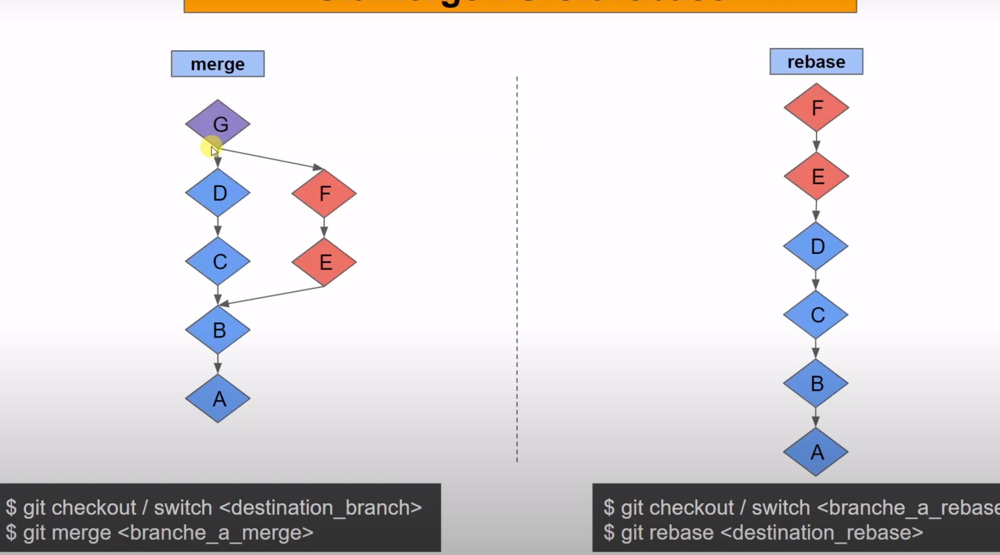

# Git, un gestionnaire de version décentralisé

# Introduction

Git c'est un gestionnaire de version décentralisé : 
* Permet de conserver les versions de tous les fichiers
* Permet de garder l'arborescence et son historique
* Permet de connaitre les versions de tous les fichiers à une date précise

Les deux mécanismes de bases sont :
* ``diff`` : 
    Outil qui permet d'avoir deux versions d'un fichier et de connaitre les changements de ce fichier entre plusieurs versions, génère un fichier qui contient la différence des deux fichiers, sous la forme :
    ```
    >>>ligne
    différence
    ...etc
    ```
    Option ``-u`` permet d'avoir plus d'info 
* ``patch`` :
    Prend un output de diff et applique la différence sur le fichier passé en argument
    
```
diff toto.c toto-oring.c > correc.patch
bzip correc.patch
bzcat correc.patch.bz2 | patch -p 0 toto.c
```

SVN (ancetre de git) stockait les patch des fichiers en mémoire et appliquait les patchs sur la version originale du fichier pour générer la version finale.

```diff
+ Définition :
+ Un arbre est un graphe acyclique, non orienté et connexe
```


```diff
+ Définition :
+ On appelle historique un graphe orienté acyclique (ce n'est pas un arbre) composé d'un ensemble de versions pouvant être recalculées à partir de versions adjacentes et appliquant les patchs modélisés par les arcs sortants.
```
**Rq** :
Cycle = quand on peut boucler sur plusieurs noeuds

La notion de branche se défini par rapport à une version.

## Définition 
La **branche** de la version vi d'un historique est le sous graphe composé de l'ensemble des versions accessibe depuis le graphe d'historique

## Définition

Le **tronc** ou la **branche principale** de l'historique est la banche issue de la dernière version stable.


Depuis 2020 la branche **master** s'appelle **main**.

## Définition

Une **sous branche** Sb1 d'une branche B2 est le sous graphe composé de l'ensemble des versions d'une branche B1 n'appartenant pas à la branche B2, l'intersection de B1 et B2 devant être nul

## Définition

On appelle **merge** toute version ayant un degré sortant > 1. Cette version correspond à la fusion de patchs de plusieurs branches.

# Architecture interne de git

1. Création d'un dépot

```
git init
```
Cette commande va juste ajouter un dossier ``.git/`` qu'on peut lire.
Pour arrêter gestion version :
```
rm -rf .git/
```

L'historique de git est global, il est uniquement à la racine contrairement à SVN (ancetre de git).

2. Création d'un dépot sur un serveur

Pas de modif des versions courantes des fichiers directement sur le serveur, sinon on ne pourra pas commit.
```
git clone --bare
```
L'option ``bare`` permet de créer un repot git qui va contenir uniquement le .git/ et donc l'historique.
On peut aussi faire un ``git init --bare`` -> même idée

3. Les objets manipulés par git

Git a été concu comme un système de fichier versionnés
Dans Linux :
Tout est fichier, un repertoir c'est un fichier...etc
Tout est **blob** dans git.

Le nom du fichier est stocké dans les repertoires dans linux, un nom est suivi d'un numéro d'**inode**.

inode = structure qui contient des infos sur le fichier et son contenu

Dans git Linus n'utilise pas de numéro d'inode mais des **SHA-1**

L'identification par hash n'est possible que si le contenu est fixe (hash sur le fichier)
-> **Les blobs sont des objets immuables**

# SHA-1

C'est une fonction de hashage cryptographique concu par la NSA. Elle est limitée à des fichiers de 2^64 bits.\
Elle retourne un hash de 160 bits (2^160 possibilité).\
Son résultat se note avec 2+38 caractères en notation exa

ex:
```
echo "une phrase" > unFile
sha1sum unFile
```
``Si on change ne serait ce qu'un donnée dans le fichier et qu'on réapplique la fonction de hash, le résultat de cette dernière est drastiquement différent.`` On parle de grande **dispersion**.
```
git fsck (file sha1sum check)
```
Permet de vérifier l'intégriter d'un dépot en recalculant tous les SHA-1. 

## Définition
Une fonction de Hash prend un ensemble de départ et projette le résultat sur un ensemble bcp + petit.

Pour que la fonction de hashage soit en o(1), il faut que le rapport entre :

$\frac{card(ens_{depart})}{card(ens_{arrivée})} = \frac{1}{2}$

Autrement dit l'ensemble d'arrivé doit être 2 fois plus grand que l'ensemble de départ.

La probabilité qu'il y ait une collision est nulle (tend vers 0 quoi).

Les risques :
* collision -> quasi nulle donc ok
* attaque -> quelqu'un de malicieux qui pourrait modifier fichier qui aurait le meme checksum

# Les 4 types d'objets

## Défintiion

Un blob est l'élément de stockage de base des données, il est id par :
* SHA-1 
Il est stocké dans le dépot sous forme d'un fichier.
iL EST formé de ``"<type> <taille du contenu \0<contenu>>"``.
Il est compressé à l'aide de la bibliothèque zlib.

Git utilise 4 types d'objets :
* ``blob`` : stocke contenu des fichiers
* ``tree`` : stocke l'arborescence
* ``commit`` : stocke les versions du dépot
* ``tag`` : id certaines versions du dépot

# Blob fichiers

## Def :
On appelle aussi blob, un blob qui stocke le contenu d'un fichier :
* composé de "blob <taille du contenu \0<contenu>"
...etc

```
git cat-file -p blob_sha-1_id
```
Permet de lire le contenu d'un blob.

Un blob est zipé, pour le lire il faut donc le décompresser avec :
```
pigz --decompress --zlib <.git/object/blob_number>
```

Pour chercher un blob :

```
echo -en "blob $(wc -c < nom_fichier\0)" | cat - foo.txt | sha1sum
```

Avec git on peut faire la meme chose en faisant :
```
git hash-object foo.txt
```

## Définition

Un arbre stocke la liste des fichiers d'un répertoire :
* Un tree est un ensemble de pointeurs vers des blobs et d'autres trees


## Définition

**Commiter** un fichier signifie :
Enregister une version de ce dernier dans un gestionnaire de version.

# SVN

Ancetre de git un peu, probleme avec ce truc c'était que le numéro de version était global. Quand on modifie un fichier ca change la version globale du projet et pas juste la version du fichier.

Git ajoute **la numérotation globale des fichiers** et pas la num globale du projet ET sauvegarde les fichiers.
## Définition

Un ``commit`` stocke l'état d'une partie du dépot à un instant, il contient :
* ptr vers tree dont on veut save letat
* ptr vers 1 ou plusieurs commit pour l'historique
* nom auteur et commiteur
* description sous forme de caractère (``-m "messg"``)

ptr = check sum vers un blob\
commit pointe tjrs vers un arbre

Commit -> Tree  -> blob\
                -> blob\
                -> tree\
                ...

Le répertoire racine d'un git n'a pas de nom, il a un nom en local dans la machine mais pas dans la structure git.

Tree = dossier 

# Les commandes 

## Définition 

Git = ens de commandes indépendantes permettant d'archiver, de rechercher et de publier des ens d'objets représentant l'état global de l'espace de tavail versionné en un temps donné

# Commit : différence SVN/Git

Git, contrairement à SVN, ajoute un état lors d'un commit. En effet un fichier modifié dans SVN est directement commit s'il est déjà versionné.

Dans git on ajoute un état "d'enveloppe", on va stocker tous les fichiers à envoyer dans cette enveloppe et c'est cette enveloppe que l'on va commit.

Cette enveloppe s'appelle en faite **INDEX**.

Pour retirer les trucs dans l'index :
```
git reset HEAD <file>
```
Pour revenir à la derniere version commitée :
```
git restore <file>
```
Attention si pas versionné et qu'on fait restore on perd la modification.

```
git add : ajoute dans l'index un fichier dans son état actuel
git commit : on commit ce qui est dans l'index
```

# Etape lors de la création d'un git

* Head -> Master
* Création d'un INDEX
* On créer un fichier foo.txt
* Création d'un blob lors de l'ajout avec ``add``
* On commit, ca va créer un blob commit et un blob tree
* La branche va donc pointer sur ce commit
* On créer un répertoire ``dir`` et un fichier dans ``dir/bar.txt``
* Ca va uniquement un blob, les tree ne seront créer que lors du commit. Si on les créer à chaque fois qu'on faisait des add faudrait les recalculer à chaque fois qu'on fait une modif donc pas opti
* On commit -> création du tree pour le directory ``dir`` 

Les 2 1er carctère du hash correspondent au dossier dans lequel le blob se trouve.

# Les branches 
```
branch * : branche active
git branch : branche actuelle
git branch maBranche : créer la branche maBranche
git switch maBranche : permet de changer de branche
git checkout : pareil que swithc mais sert aussi a changer de version de fichier 
git switch -c maBranche : créer la branche + switch 
```
# Merge
## Sans conflit 
On est sur Mabranche qui est en avance sur main.
On veut les merge.

fast-foward = merge qui ne génère pas de conflit

* On va dans Master,
* ``git merge maBranche``
* Si pas de conflit c'est instantanné et ca remonte le main

``git merge ff only maBranche`` : merge que si pas de conflit et que ca marche en fast forward 

``git branch -d maBranche`` : supprime la branche

## En cas de conflit de merge

On est sur maBranche et on veut la merge sur main.
On va sur main, ff marche pas.\
On va faire un merge :
```
git switch master
git merge maBranche
git branch -d maBranche
```
Ca va créer un nouveau commit pour merge les deux dans l'arbre.

Rebase -> fait un truc zarbi

On peut rebase une sous branche sur une autre branche directement.\
Exemple slide 59, on veut merge commit 6 et 7 uniquement sur master.\
Pb sous branche branche2 est basée sur branche1, on fait donc :
```
git rebase --onto master branche1 branche2
```
Permet de merge branche2 à partir de la branche1 sur le master

# Merge vs rebase



Créer un historique différent.


 # Les remords

 3 facon de corriger une erreur
 * revert
 * amend -> interdit sur on a deja push
 * reset -> interdit sur on a deja push

 En cas de push on peut juste faire un revert

```
git revert HEAD^
```
Ajoute un nouveau commit qui efface le contenu de l'avant dernier commit

# Git reset : danger

```git reset``` permet de supprimer un ou plusieurs commit

En pratique les objets liés aux commits supprimés par git reset ne sont supprimés que par le ``garbage collector`` (au bout de 15j environ)

Quand l'index pointe sur un tree il est pas vraiment construit -> slide 65 le tree bc45 n'existe pas vraiment devrait être en pointillé.

# Syncrhonisation avec les dépots distants

``git pull`` = ``git fetch``+``git merge``\
``git fetch`` : charge les mise à jour du server distant\
``git merge`` : merge avec la version locale

Mieux de pas faire git pull, on peut faire un ``git merge --ffonly`` comme ca on voit vraiment les conflits au cas ou

``origin/main`` : c'est le main du server alors que ``main`` c'est la branche locale

# Remarques 

## Mot clef :
* blob
* tree
* inode 
* commit 
* lien physique
* lien symbolique

1. http://books.gigatux.nl/mirror/kerneldevelopment/0672327201/ch12lev1sec6.html
2. https://www.journaldunet.fr/web-tech/developpement/1203057-comment-creer-un-lien-symbolique-sous-linux/#:~:text=Contrairement%20aux%20liens%20physiques%2C%20le,renvoie%20directement%20au%20fichier%20original.
3. https://delicious-insights.com/fr/articles/git-commit-detail/

* ``git log`` : permet de visualiser l'historique