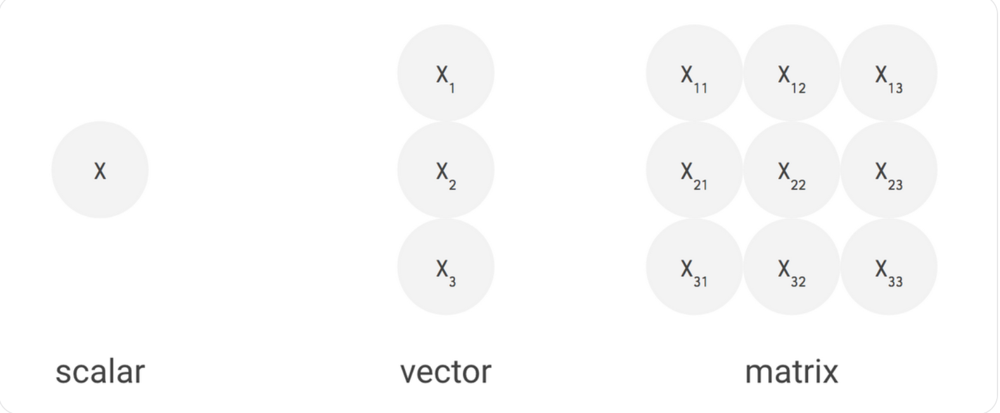
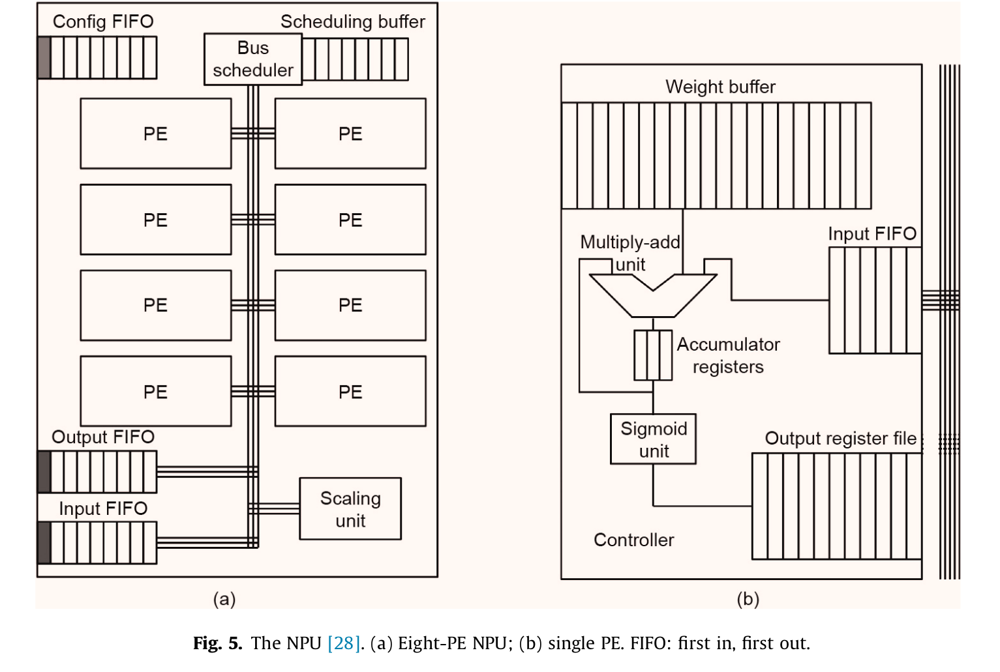

NPU = neural processor unit

https://en.wikichip.org/wiki/neural_processor

# TPU (ref 1)
## Neural network

We got input data (x1, x2, x3...etc). 
On multiplie les données par un poids wi et on accumule le résultat dans le neurone, puis on applique une fonction d'activation.

exemple : 
```
On a deux neurones y1 et y2, 3 data en inputs x1, x2 et x3.

y1 = w11*x1 + w12*x2 + w13*x3
y2 = w21*x1 + w22*x2 + w23*x3

Ensuite on applique une fonction d'activation :


y1 = f1(w11*x1 + w12*x2 + w13*x3)
y2 = f2(w21*x1 + w22*x2 + w23*x3)
```

Les fonctions d'activation peuvent être ReLU, sigmoid, tanh...etc

Du coup avec 3 inputs et deux neurones on a fait 6 multiplications et 6 additions. Pour simplifier on peut faire le calcul sous forme de matrice.
```
              x1   
w11 w12 w13 * x2  = w11*x1 + w12*x2 + w13*x3
              x3
```

## TPU architecture

Un TPU contient :
* Matrix multiplier unit (MXU)
* Unified buffer (UB)
* Activation unit (AU): Hardwired activation functions

Scalar processor are to slow to perform the kind of operation needed.
CPUs incorporate instruction set extensions such as **SSE** and **AVX** that express such vector operations.

The streaming multiprocessors (SMs) of GPUs are effectively vector processors, with many such SMs on a single GPU die.




In the case of the TPU, Google designed MXU as matrix processor that process hundreds of thousands of operations per cycle.

Pour faire ca le coeur du TPU utilise **systolic array**.

### **systolic array** :
```
One example of how a systolic array can work is in matrix multiplication. Suppose we have two matrices, A and B, with dimensions m x n and n x p, respectively. A systolic array with m processing elements arranged in a row can be used to calculate the matrix product C = A x B.

Initially, the first row of matrix A and the first column of matrix B are loaded into the systolic array. Each processing element multiplies its input values and passes the result to its right neighbor, which adds the result to its own accumulated sum. This process is repeated for each subsequent row of matrix A and column of matrix B, with the accumulated sums at the end of the row representing the corresponding element of the resulting matrix C.

By using a systolic array, the matrix multiplication operation can be performed in O(mnp) time, which is faster than the traditional O(n^3) time required for matrix multiplication using a sequential algorithm.
```

Pour les MXU, on va pas direct store le résultat dans un registre après le calcul de l'ALU, on va le réutiliser.
On a un chainage d'ALU pour effectuer des opérations.

# NPU architecture (ref 2)

NPU contains 8 PEs (processing engines). Each PE performs the computation of a neuron (multiplication, addition and sigmoid).

If a program segment is frequently executed and approximable, and if the inputs and outputs are well defined, then that segment can be accelerated by the NPU.

Pour utiliser un NPU, les programmeurs doivent manuellement anoté une portion de code qui satisfait les critères ci dessus.



The weight buffer, a circular buffer, stores the weights. When a PE receives an
input from the bus, it stores the value in its input FIFO.
When the neuron weights for each PE are configured,
they are placed into the weight buffer; the compilerdirected schedule ensures that the inputs arrive in the
same order that their corresponding weights appear in
the buffer. This way, the PE can perform multiply-andadd operatio

# NPU vs TPU

There are some differences between NPUs and TPUs. One key difference is that TPUs are specifically designed to accelerate deep learning tasks, while NPUs can accelerate a broader range of machine learning algorithms. TPUs are also developed by Google and are only available on the Google Cloud Platform, while NPUs can be developed and used by any company or organization.

GPU perform SIMD instructions while NPU and TPU uses 2D SIMD.

# How to use NPU

3 steps :
* Programming : programmer marks code region to be transformed
* compilation : compiler selects and trains a suitable neural network an replace the original code with a NN
* execution

Once the source code is annotated, the compiler applies the parrot transform in three steps :
* code observation
* neural network selection and training
* binary generation

**Candidate code for the Parrot transformation must satisfy three cri-
teria: it must be frequently executed (i.e., a “hot” function); it must
tolerate imprecision in its computation; and it must have well-defined
inputs and outputs.**

```c

float sobel[[PARROT]](float[3][3] p) {
    float x, y, r;
    x = (p[0][0] + 2 * p[0][1] + p[0][2]);
    x = (p[2][0] + 2 * p[2][1] + p[2][2]);
    y = (p[0][2] + 2 * p[1][2] + p[2][2]);
    y = (p[0][0] + 2 * p[1][1] + p[2][0]);
    r = sqrt(x*x + y*y);
    if (r >= 0.7071) r = 0.7070;
    return r;
}

void edgeDetection ( Image& srcImg , Image& dstImg ) {
    float [3] [3] p; 
    float pixel ;
    for ( int y = 0 ; y < srcImg.height ; ++y )
        for ( int x = 0 ; x < srcImg.width ; ++x )
        srcImg.toGrayeScale ( x , y ) ;
    for ( int y = 0 ; y < srcImg.height ; ++y )
        for ( int x = 0 ; x < scrImg.width ; ++x ) {
        p = srcImg.build3x3Window ( x , y ) ;
        pixel = sobel ( p ) ;
        dstImg.setPixel( x , y , pixel ) ;
    }
}
```

```c

void edgeDetection(Image& srcImg, Image& dstImg) {
    float p[3][3];
    float pixel;

    for (int y = 0; y < srcImg.height; ++y) {
        for (int x = 0; x < srcImg.width; ++x) {
            srcImg.toGrayeScale(x, y);
        }
    }

    for (int y = 0; y < srcImg.height; ++y) {
        for (int x = 0; x < scrImg.width; ++x) {
            p = srcImg.build3x3Window(x, y);

            NPU_SEND(p[0][0]);
            NPU_SEND(p[0][1]);
            NPU_SEND(p[0][2]);
            NPU_SEND(p[1][0]);
            NPU_SEND(p[1][1]);
            NPU_SEND(p[1][2]);
            NPU_SEND(p[2][0]);
            NPU_SEND(p[2][1]);
            NPU_SEND(p[2][2]);

            NPU_RECEIVE(pixel);
            dstImg.setPixel(x, y, pixel);
        }
    }
}
```

In the Sobel filter example, parts of the code that process the pixels
can be approximated. The code region that computes pixel addresses
and builds the window for the sobel function (line 8 in the bottom box
of Figure 2a) needs to be precise to avoid memory access violations.
However, the sobel function, which estimates the intensity gradient of
a pixel, is fundamentally approximate. Thus, approximate execution
of this function will not result in catastrophic failure and, moreover, is unlikely to cause major degradation of the overall edge detection
quality. These properties make the sobel function a suitable candidate
region for approximate execution.
# Références 

1. https://cloud.google.com/blog/products/ai-machine-learning/an-in-depth-look-at-googles-first-tensor-processing-unit-tpu?hl=en
2. A Survey of Accelerator Architectures for Deep Neural Networks