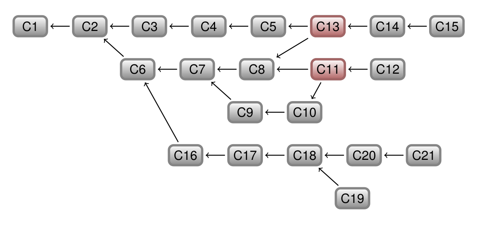
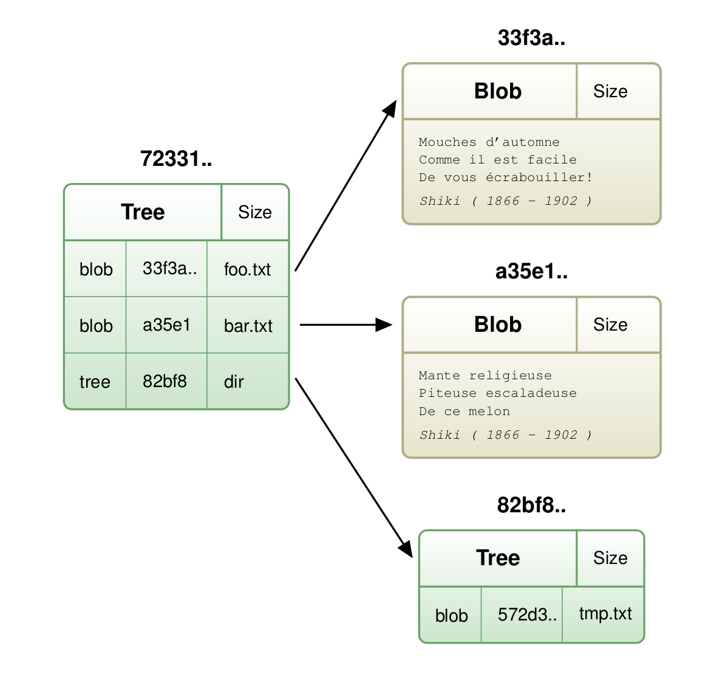
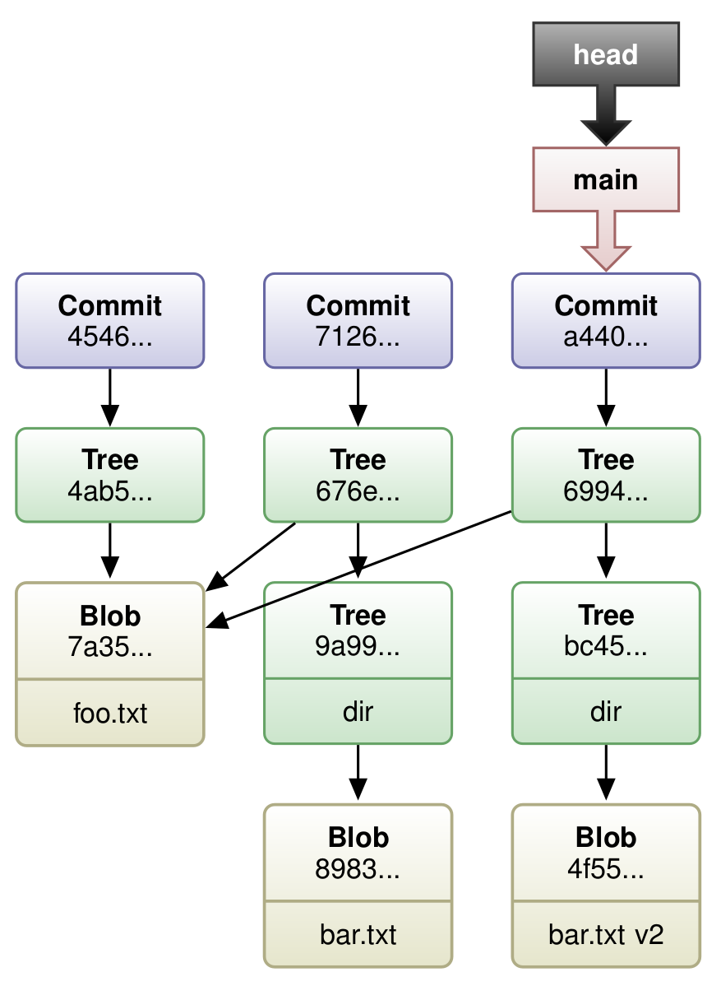
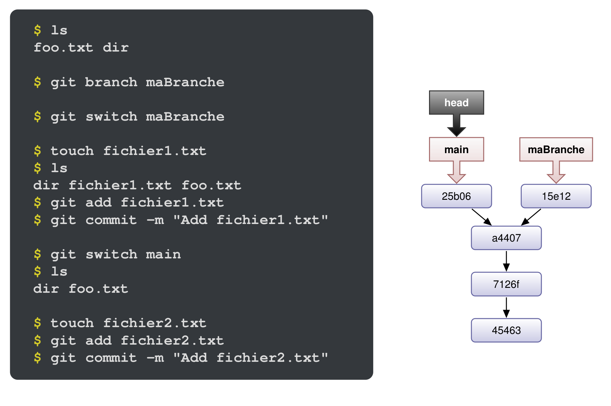
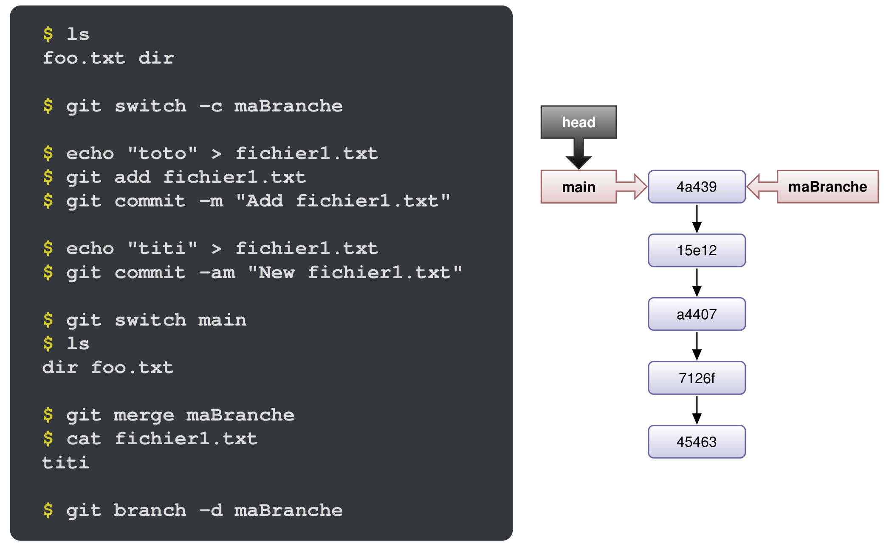
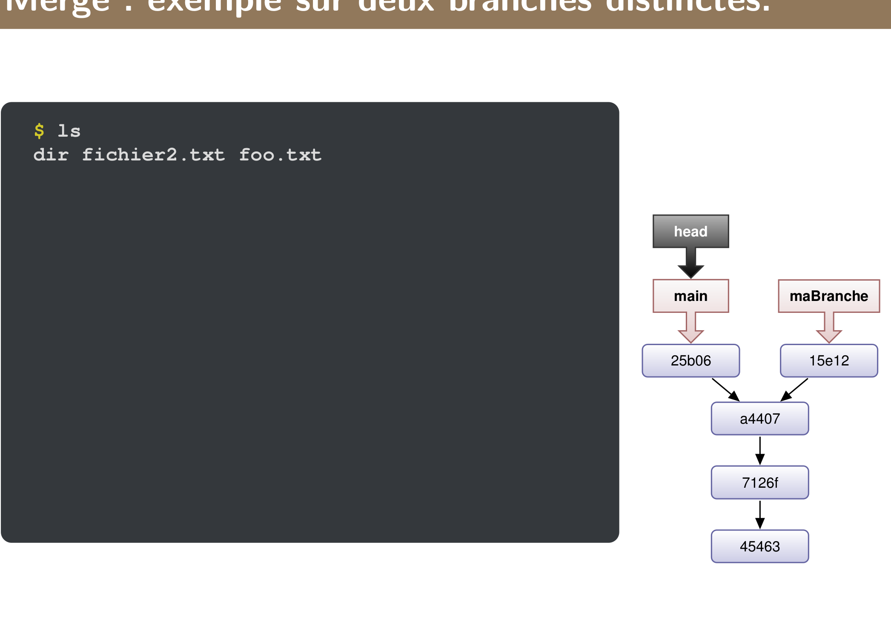
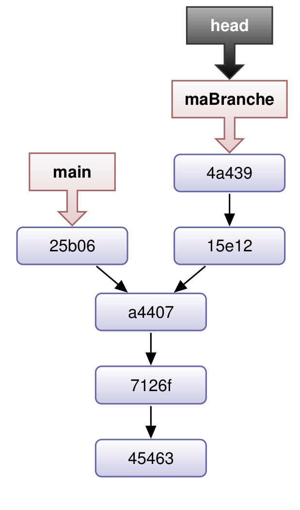
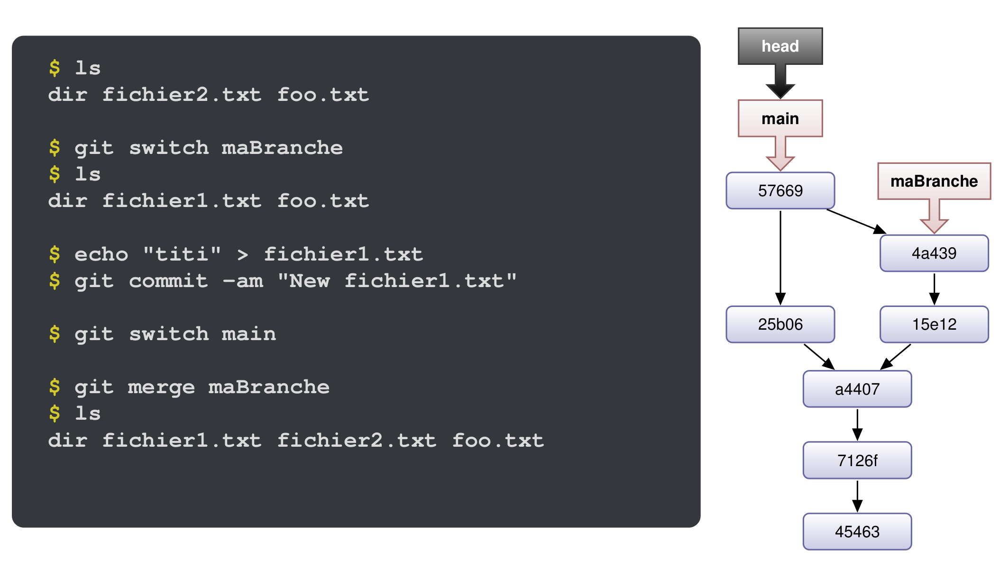
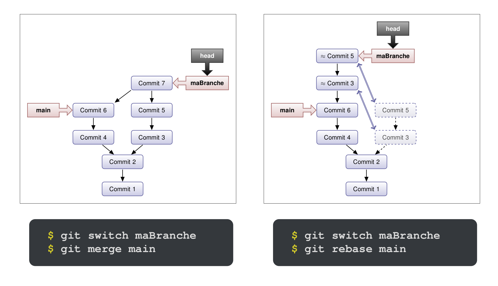
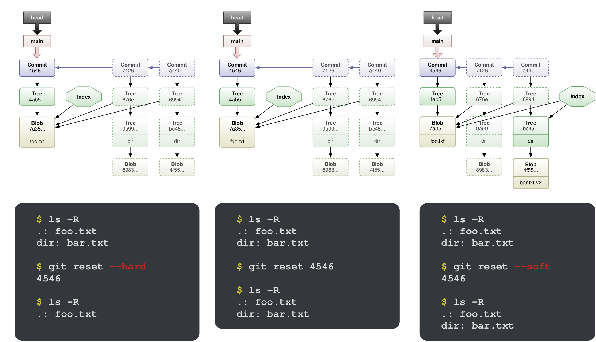

# Git
## Définitions
* VCS (version control system) :
    * conserve toutes les versions des fichiers
    * conserve l'arborescence des fichiers
    * identifie une arbo de versions de fichiers
* DVCS (distributed version control system) :
    * meme service que VCS mais sur une archi décentralisé

Différence :\
A **VCS** typically uses a **central repository** to store all versions of the files, and all developers are required to access this central repository in order to make changes to the files. This means that developers are dependent on a stable connection to the central repository in order to work on the project.

A **DVCS**, on the other hand, allows developers to have their **own local copy of the repository** on their own computer, and changes made by one developer can be synced with the other developers' copy of the repository. This allows for offline work and more flexibility in collaborating.
Git is an example of a DVCS.

Dans les deux cas ca repose sur deux mécanismes :
* diff/patch
* gestionnaire d'historique des diff

```c
diff toto.c toto-origin.c > correc.patch //diff entre toto.c et toto-origin.c 
bzip2 correc.patch                       //compress la difference
bzcat correc.patch.bz2 | patch -p 0 toto.c // décompresse le fichier compresse par bzip2 et applique la différence au fichier original toto.c, applique le patch
```

* historique = **graphe orienté acyclique** composé d'un ensemble de versions pouvant être recalculé à partir des versiosn adjacentes. 

* graphe orienté acyclique :\
An acyclic oriented graph (AOG) is a type of directed graph where the edges have a direction and the graph does not contain any cycles. A cycle in a directed graph is a sequence of edges that connect a vertex back to itself.

* branche de la version vi = sous graphe composé de l'ensemble des versions accessibles depuis vi dans le graphe d'historique.

* tronc/branche principale = branche issue de la dernière version stable de l'histo

* sous branche :
Une sous-branche est une branche qui est créée à partir d'une autre branche existante dans un système de contrôle de version comme Git.
La branche à partir de laquelle la sous-branche est créée est appelée la branche parent ou la branche principale.

* merge :
On appelle merge toute version ayant un degré sortant supérieur à 1. Degré sortant > 1 signifie qu'on a deux commits qui vont sortir d'un seul.


* working tree/working directory :\
In the context of Git, a **working tree**, also known as a **working directory**, is the set of files and directories that are being tracked by Git in the local repository on a developer's computer. It is the place where developers can view and make changes to the files in the repository.

## Initialiser repo

Permet d'initialiser un repo qui va contenir uniquement l'historique. Il ne contient pas les fichiers donc il n'y a pas de working tree.
```
git clone --bare
```

```
git init is used to initialize a new Git repository in your current directory. It creates a new directory named .git that contains all the necessary files for version control, including the repository's history and metadata.

git init --bare is used to create a bare repository, which is a special type of repository that doesn't contain a working copy of your files. Instead, it only contains the repository's history and metadata. Bare repositories are typically used as centralized repositories for team collaboration, or for backups.
```

## Objets manipulés par git

"Tout est blob"

Les blobs sont identifiés par le SHA-1 de leur contenu, au même titre que les fichiers de linux sont idéntifiés par leur numéro d'inode.

### SHA-1

Fonction de hashage cryptographique concu par la NSA.
* limitée à des fichiers de 2⁶⁴ bits
* retourne un hash de 160 bits
* son résultat se note avec 40 caractère en notation hexa 

Renvoie la check sum d'un fichier. La moindre modif du fichier modifie la check sum.
```
echo "une phrase" > unFile
sha1sum unFile
```

Pour vérifier l'intégrité d'un repo on peut recalculer l'ensemble des SHA-1 à l'aide de :
```
git fsck (file sha1-sum check)
```

Plus précisement la commande vérifie :
En gros ca part d'un numéro de commit, ca calcule la checksum de tous les fichiers, ca applique des pathcs et ca vérifie que la check sum est ok.

Dans git les clefs sont stockés dans .git/objects/XX/YYYYY...\
Où XX : 2 octets de poids fort de sha-1\
Où YY..Y : 38 octets restants

## Blob

Le blob est l'élément de base pour le stockage des données, il est id par :
* SHA-1 
* stocké dans le dépot sous forme d'un fichier : 
.git/object/sha1(40:0)/sha1(38:0)
* formé de :\
``"<type> <taille du contenu \0<contenu>>"``
* compréssé à l'aide de **zlib**

Git utilisé 4 types de blob :
* blob fichié (pas le meme que le blob au sens inode)
* blob tree : stocke arbo
* blob commit : stocke version
* blob tag : identifie certain version du repo

## Blob fichiers

On appelle aussi blob, un blob qui stocke le contenu d'un fichier, ils sont composés de :
* ``blob <taille du contenu \0<contenu>``
* A chaque version du fichier correspond un nouveau blob
* le blob ne dépend pas du nom ou de l'emplacement du fichier

Pour lire le contenu d'un blob fichier :
```
git cat-file -p blob_sha1
```
Permet de mettre au format ``blob <taille du contenu \0<contenu>``
```
echo -en "blob $(wc -c < foo.txt)\0" | cat - foo.txt | sha1sum
6ded47ba437cb9cc986e47bafc146c75e50be03c -
```
* -en : désactive insertion d'un caractère new line et 
* wc -c compte le nombre de caractère dans un fichier
* < foo.txt redirige le fichier foo.txt dans la commande wc
* | cat - foo.txt : concatene la sortie de echo avec le contenu du fichier
* sha1sum donne la checksum de tout ca

Donne le hash du fichier.
```
git hash-object foo.txt
```

## Tree

Stocke la liste des fichiers d'un répertoire. C'est un ensemble de pointeur vers des blobs et d'autres trees.
Un tree associe un nom de fichier à chacun des blobs fichiers/ blobs tree.



On voit bien dans la photo que le blob tree contient des pointeurs vers les blobs fichiers, et vers des blobs tree.

On peut aussi faire la commande suivante sur un blob tree
```
git cat-file -p sha1_blob_tree
```
Ca donnera le contenu du blob tree qui sera donc le type de blob pointé, le hash sha1 et le nom du fichier/repertoire

# Commit

Commiter = enregister une version du fichier dans le gestionnaire de version.
Git utilise une numérotation globale des versions des fichiers, c'est à dire que chaque fichier est identifié par un numéro unique sha1.

Un commit contient :
* un ptr vers un tree dont il souhaiter sauver l'état
* un ptr vers 1 ou plusieurs autres commits pour constituer l'historique
* un nom d'auteur et d'un commiteur
* une description sous forme de chaine de caractère
* Une date en notation Epoch (changement de date modifie le sha1 du commit)

## Tag

Un tag permet d'identifier un ou des objets précédents à l'aide d'un nom. Il contient :
* un ptr vers blob tree/commit/fichier
* une signature

# Commandes :

* add : ajoute un fichier dans son état actuel dans l'index 
* commit : enregistre dans le dépot local les modifications ajouté dans l'index par une commande add
* reset HEAD : supprime la référence d'un fichier de l'index ajouté par une commande add

# Etude des objets généré :

```
mkdir project
cd project
git init
echo "toto" > foo.txt
git add foo.txt
```

* HEAD : pointeur sur le dernier commit réalisé, il pointe sur la branche sur laquelle on est courrament. Quand on fait un commit il va changer pour aller pointer sur le nouveau commit de sorte à être à jour. Pour changer le HEAD il faut donc faire un ``git commit``.
* Index : Aussi connu sous le nom de ``staging area`` ou ``staged changes``. Il garde une copie des fichiers qui seront dans le nouveau commit. C'est une zone intermédiaire utilisée avant de faire le commit.
Pour ajouter des fichiers dans l'index il faut faire ``git add``.

Faire un git commit permet donc de bouger depuis le pointeur d'index vers le pointeur de HEAD.

Quand on commit ca va céer deux blobs :
* un blob commit 
* un blob tree

ex :
```s
mkdir projet
cd projet
git init
echo "toto" > foo.txt
git add foo.txt             # deplace l'index
git commit -m "adding foo"  # créé un blob tree et blob tree

mkdir dir
echo "titi" > dir/bar.txt
git add dir/bar.txt
git commit -m "Add dir/bar.txt"

echo "tutu" >> dir/bar.txt
git add dir/bar.txt
git commit -m "Modif dir/bar.txt"
```


# Les branches

## Commandes :

* git branch : liste les branches avec * pour la branche active
* git branch nom : créer un nouvelle branche nom
* git branch -m : permet de renommer une branche
* git branch -d : permet de supprimer une branche
* git switch : change la branche active
* git switch -c : créer une branche et l'active
* git show-branch : affiche les branches et leur commit

* Est ce que la création d'une branche créer un nouveau blob ?\
Creating a new branch in Git does not create a new blob.
When you create a new branch, Git creates a new reference pointer that points to the same commit as the branch you were on when you created the new branch.
* quand on fait git switch et qu'on change de branche, ca change le pointer HEAD vers la branche

### exemple :



# Les merges
## fast forward
On veut merge maBranche sur le main.
```sh
git switch main # on va sur la branche sur laquelle on veut merge
git merge maBranche # on met le nom de la branche sur laquelle on veut merge
git branch -d maBranche # on supprime b1
```

Dans le cas ci dessous, on créer une branche à partir du commit a4407 et l'on commit dessus sans rien commiter sur le main. Quand on va faire le git merge ca va juste remonter le pointeur du main sur le dernier commit de la branche maBranche.


## Merge deux branches distinctes

On parrt de la situation ci dessous, on a des commit sur le main et sur la branche maBranche, il va donc falloir merge correctement maBranche sur le main.



On va commiter à plusieurs reprise sur maBranche, créant ainsi l'historique suivant :


Maintenant on veut merge maBranche sur le main, pour faire ca on va faire :
```sh
git switch main     # on va sur le main
git merge maBranche # on merge maBranche
git branch -d maBranche # on supprime la branche
```

Ca va créer un commit de merge 57669 et ca va donner l'historique suivant :


# Les rebases

Un merge, au contraire d'un rebase ne conserve pas l'historique de la branche, le merge créer simplement un commit de merge.

Le rebase au contraire va placer les commandes de la branche sur le branche sur laquelle on merge.



```sh
git rebase --onto main branche1 branche 2
```
* The "--onto" flag tells Git that the next two arguments are the new base commit and the starting point for the rebase.
* "main" is the new base commit where the commits from branche2 will be replayed on top of.
* "branche1" is the starting point for the rebase. This is the point where Git will stop considering commits from branche2 to replay.
* "branche2" is the branch whose commits will be replayed.

For instance, if we have this :
```
A - B - C (main)
    \
     D - E - F (branche1)
              \
               G - H - I (branche2)
```

It will create this :
```
A - B - C - G' - H' - I' (main)
    \
     D - E - F (branche1)
              \
               G - H - I (branche2)
```

Commit from branche2 will be put onto branch main

# Erreur de commit

En cas d'erreur de commit, git propose 3 solutions :

* revert : annule un commit par un autre commit 
* amend : modifier le dernier commit -> interdit sur on a deja push
* reset : rétablir la situation d'un ancien commit -> interdit sur on a deja push

**Si l'erreur a déjà été rendue publique, la seule bonne version est le revert.**

Ajoute un nouveau commit qui efface le contenu de l'avant dernier commit :
```
git revet HEAD^
```

### Types de reset :

* git reset --hard :
    * restore la référence du commit
    * restore l'index
    * restore les données   
* git reset :
    * restore la référence du commit 
    * restore l'index
* git reset soft :
    * restore la référence du commit



# Comparaison

* git diff : différence entre le répertoire de travail et l'index 
* git diff --staged : différence entre HEAD et l'index
* git diff HEAD : différence entre répertoire de travail et HEAD
* git diff <commit> : différence entre le répertoire de travail et un autre commit 

```r
git show
commit 7a618a3f3c23262ad281c9afe69e145ef867d43b
Author: Julien SOPENA <julien.sopena@lip6.fr>
Date: Mon Oct 25 03:55:27 2010 +0200
Ceci est un petit exemple de commit.
diff –git a/test b/test
index 808a2c4..99810fa 100644
–- a/test
+++ b/test
@@ -1,3 +1,3 @@
Ligne de texte non modifié par ce commit.
-Ligne de texte supprimée.
+Nouvelle ligne de texte
Suite du texte non modifié.
```

# Local vs remote

* main : branche main locale
* origin/main : branche main sur le serveur distant

* git push origin : permet de pusher les modifications locale sur la branche distante

## Créer une branche en remote :

```sh
git branch newbranche
git checkout newbranche
# on fait des modifs puis on commit
git commit 
it push -u origin newbranchname # ca va envoyer la nouvelle branche en remote
```

* The "-u" flag sets the new branch as the upstream branch, so that future "git pull" and "git push" commands will work without specifying the branch name

## Merge

* Make sure you are on the branch that you want to merge the changes into. For example, if you want to merge changes from the "feature" branch into the "main" branch, use the command "git checkout main" to switch to the main branch.

* Use the command "git merge feature" to merge the "feature" branch into the current branch. This will automatically create a new merge commit that brings the changes from the "feature" branch into the current branch.

* In case of conflicts, Git will stop the merge and ask you to resolve the conflicts before committing the merge.

* Once the merge is done and the conflicts are resolved, you can use the command "git push" to push the changes to the remote repository.

* You can also use git merge --no-ff if you want to keep all the commits on the feature branch and not just the last one.

## Destroy branch

```
git push origin --delete branch_name
```

To confirm that the branch was deleted, you can use the command "git ls-remote --heads origin" to list all the branches on the remote repository, and the branch you just deleted should not appear in the list anymore.

# Remarques

* git add -A : ajoute tous les fichiers dans l'index, les fichiers modifiers, supprimés...etc
* git commit -a :
Changes in the working directory, including new files, modified files, and deleted files. This option is useful when you want to quickly commit all changes without having to stage them first.
* In Git, "staging" refers to the process of preparing changes for a commit. When you make changes to files in your working directory, those changes are not immediately included in a commit. Instead, you must first "stage" the changes, which adds them to a special area called the "index" or "staging area". Once the changes are staged, you can then create a commit that includes those changes.