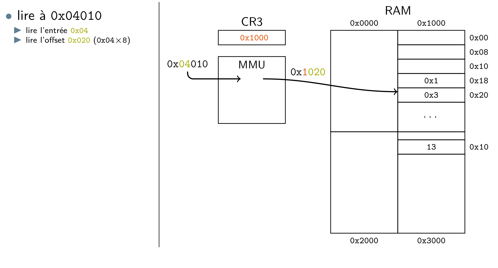
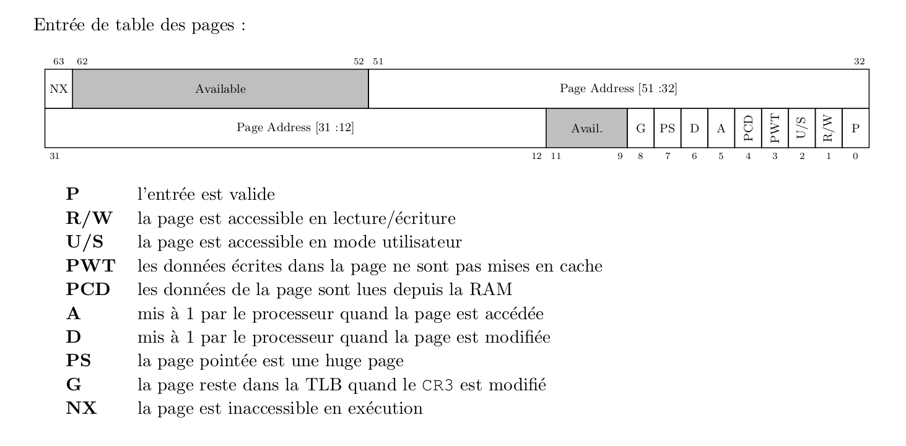

# **Gestion de la mémoire**

Ce cours s'interesse au fonctionnement de la mémoire virtuelle.

Pour que tout fonctionne correctement, il y a certaines règles quant à l'attribution de la mémoire :
* Une adresse ne doit pas être attribuée plusieurs fois
* L'adresse doit pouvoir être remise à disposition par son détenteur
* Les adresses ne peuvent être attribués qu'en ordre croissant

## **Gestion de la mémoire en mode USER**

### **La pile**

* Le sommet de la pile est stocké dans un registre (sp en RISCV/MIPS, rsp en X86).
* La gestion de la pile est réalisé par le **prologue** et l'**épilogue** d'une fonction.\
exemple :\
On rappelle qu'en X86, rdi est le registre pour le 1er paramètre de fonction et rsi le 2ème.
```c
int f(long x)
{
    long y = 13
    return x+y
}

int main(void){
    long a,b = 12
    a = f(b)
    return 0
}
```
```s
sub $8, %rsp        # case vide pour a
push $12            # push 12 dans la pile pour b
mov 0(%rsp), %rdi   # passage de paramètre
call f              # appel de f
add $16, %rsp       # restaure la pile 
ret
```
Une fois dans la fonction, on va avoir le code suivant :
```s
push $13
mov %rdi, %rax
add 0(%rsp), %rax # add the value at the memory location rsp+0 to rax and store the result in rax
ret
```
A la fin de la fonction f, la pile ressemble à ca :

### **Le tas**

```c
int main(void){
    void *a, *b, *c;
    a = malloc(20);
    b = malloc(12);
    free(a);
    c = malloc(18);
    return 0;
}
```
Dans le cas ci dessus, on alloue 20 octets pour a, 12 pour b, on free a (annule réservation) et alloue 18 octets pour c.

malloc n'est pas un appel système, il s'agit d'une fonction ``userland``.
Elle alloue de grosse plage d'adresse grâce à l'appel système ``mmap``.
ATTENTION l'utilisation de malloc créer deux types de fragmentation mémoire :
* fragmentation interne : on alloue plus que ce que l'on utilise
* fragmentation externe : entre deux allocations il peut y avoir des miettes du a des free
### **Compilation et adressage : fichier objet et executable**

Les adresses ne sont pas défini dans le .o, par le compilateur elles sont remplacées lors de l'édition de lien. En effet si deux programmes initialise une variable globale n et qu'on génère les .o, les deux adresses pourraient se trouver à la même adresse et ca génèreraient des conflits.

C'est seulement au moment de la création de l'exécutable que le compilateur attribue une adresse à tous les symboles :
* via un script d'édition de lien (info ld)
* via des options dédiées (gcc -Wl)
* via des valeurs prédéfinies

Les symboles sont remplacés par leurs adresses dans le code, les adresses peuvent être absolue ou relatives.

### **Conclusion**

Gérer la mémoire se résume à attribuer des adresses.

La mémoire est donc géré par la pile (épilogue et prologue des fonctions, c'est l'**ABI** qui définit ce que l'on met en pile) et pas les librairies spécialisées.

``Mais comment isoler les adresses de différents processus ?`` -> La MMU va permettre ca.

## ***Mémoire virtuelle et MMU***

CPU -> adresses virtuelles envoyées à la MMU
MMU -> traduit VA en PA.

Les adresses recues par la MMU sont celles recues à l'édition de lien. Ca veut dire que les étapes sont les suivantes :
* écriture programme (c, c++...etc)
* Création du fichier objet (utilisation de symbole à la place d'adresses)
* Création de l'executable (édition de lien), les symboles sont remplacés par des adresses
* Adresses de l'executable sont envoyés à la MMU qui va faire la traduction VA/PA

MMU utilise une table de traduction, elle est reconfigurée à la commutation, ce qui permet d'éviter la collision d'adresse.

### **Traduction d'adresse et table des pages : definitions**

``Page`` = donnée de taille fixe, en général une page fait 4ko

``Emplacement de page`` = emplacement suceptible de contenir une page. Si cet emplacement est en mémoire il a une adresse alignée sur la taille d'une page

Adresse est découpée en deux parties :
* INDEX  : indique l'emplacement de la page
* OFFSET : indique un déplacement dans la page

### **Fonctionnement traduction d'adresse**

* Le cpu génère une adresse virtuelle
* L'adresse physique de la table des pages est stockée dans le registre CR3
* La MMU lit l'adresse virtuelle et extrait l'index, elle accède à la page correspondante et lit la donnée



Sur l'exemple ci dessus, on veut lire l'adresse ``0x04010``, l'index vaut ``0x04`` et l'offset ``0x010``.

On va donc d'abord accéder à la bonne page, pour ce faire on accède à la 4ème case à partir de l'adresse de CR3, on obtient 0x3000 comme adresse. On ajoute l'offset de départ, ce qui nous donne 0x3010 comme adresse.

### **Structure réelle de la table des pages**

Structure creuses, 4 niveaux de tables des pages (PML4, PML3, PML2, PML1).
* Extension de signe = 16 bits
* PML = 9 bits
* OFFSETS = 12 bits

Pour une seule lecture on va faire 5 accès mémoire (PML4, PML3, PML2, PML1 puis donnée avec déplacement).  

### **Optimisation**

Pour réduire les temps d'accès, utilisation d'un cache de traduction d'adresse TLB. La TLB stocke des pairs adresse virtuelle/adresse physique.

ATTENTION, bien noté que quand on accède à une donnée, il faut compter 4 + 1 accès mémoire pour traduire l'adresse et accéder à la donnée.

Pour éviter ce genre de longueur d'accès, une solution est d'augmenter la taille d'une page. C'est ce qu'on appelle une **huge page**. L'offset passe à 21 bits et on supprime un niveau de PML.

La TLB est automatiquement vidée quand le CR3 est modifié par une commutation de process. 

Dans les processeurs modernes, on utilise un PCID (Process Context IDentifier) à chaque table des pages. Cette valeur est stockée dans le CR3 avec l'adresse de la table. Chaque entrée TLB est taguée avec le PCID courant, seuls les entrées de la TLB avec le PCID courant sont utilisés. -> Plus besoin de flusher la TLB

## **MV dans linux**

Les processeurs x86 utilisent la pagination et la segmentation. 
* En 32 bits -> segmentation obligatoire, pagination optionnelle
* En 64 bits -> l'inverse

Voici les bits contenus dans une entrée de la table des pages :



Si le processeur tente d'utiliser une entrée non valide ou avec des permissions insuffisantes ca déclenche une ``page fault``.

* Evènement synchrone -> exception
* Evènement asynchrones  -> reception ethernet, alerte thermique ...etc

### **Exceptions**

Une exception ne conduit pas forcément au crash, ca appelle l'OS qui peut retenter de lancer l'opération.

### **Allocation paresseuse**

Un traitement est dit paresseux s'il n'est effectué qu'au moment où on a besoin.

ex: 
```c
if(func_a() && func_b())
```
func_b() est appelée qu'au moment où l'on connait le résultat de func_a(). Si func_a() renvoie 0, func_b() n'est pas appelé.

L'allocation de mémoire est aussi paresseuse sous linux, on parle d'**allocation paresseuse First touch**.
* mémoire virtuelle est allouée pendant l'appel de mmap()
* mémoire physique est allouée à la première touche d'une page

### **Exemple de malloc**

* ``malloc()`` appelle ``mmap()``
* ``mmap()`` fait le mapping mais pas l'allocation
* ``mmap()`` remplie le ``tree_contains`` qui contient les VA valides
* ``malloc()`` retourne la 1ère adresse de la zone mappée par mmap()
* Quand programme utilise adresse, ca va faire une page fault et le gestionnaire d'exception va allouer la page
### **Noyau**

* Mappé au même endroit en virtuel
* Page protégé, inaccessible en mode user