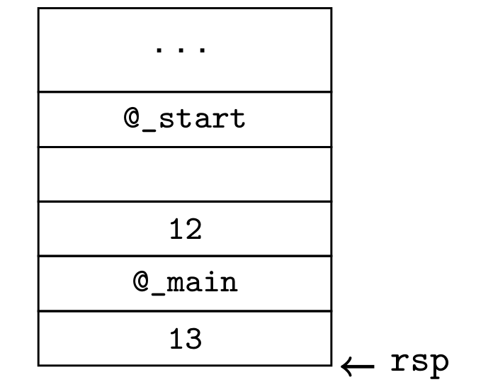

# **Gestion de la mémoire**

Ce cours s'interesse au fonctionnement de la mémoire virtuelle.

Pour que tout fonctionne correctement, il y a certaines règles quant à l'attribution de la mémoire :
* Une adresse ne doit pas être attribuée plusieurs fois
* L'adresse doit pouvoir être remise à disposition par son détenteur
* Les adresses ne peuvent être attribués qu'en ordre croissant

## **Gestion de la mémoire en mode USER**

### **La pile**

* Le sommet de la pile est stocké dans un registre (sp en RISCV/MIPS, rsp en X86).
* La gestion de la pile est réalisé par le **prologue** et l'**épilogue** d'une fonction.\
exemple :\
On rappelle qu'en X86, rdi est le registre pour le 1er paramètre de fonction et rsi le 2ème.
```c
int f(long x)
{
    long y = 13
    return x+y
}

int main(void){
    long a,b = 12
    a = f(b)
    return 0
}
```
```s
sub $8, %rsp        # case vide pour a
push $12            # push 12 dans la pile pour b
mov 0(%rsp), %rdi   # passage de paramètre
call f              # appel de f
add $16, %rsp       # restaure la pile 
ret
```
Une fois dans la fonction, on va avoir le code suivant :
```s
push $13
mov %rdi, %rax
add 0(%rsp), %rax
ret
```
A la fin de la fonction f, la pile ressemble à ca :

## ***Mémoire virtuelle et MMU***

## **MV dans linux**
