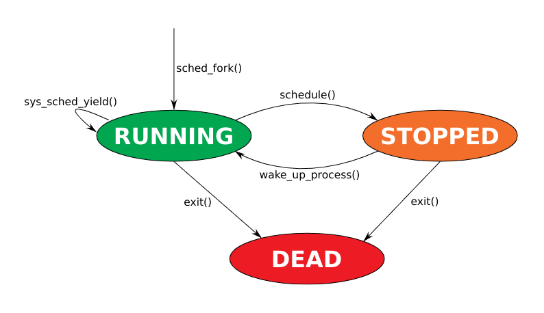
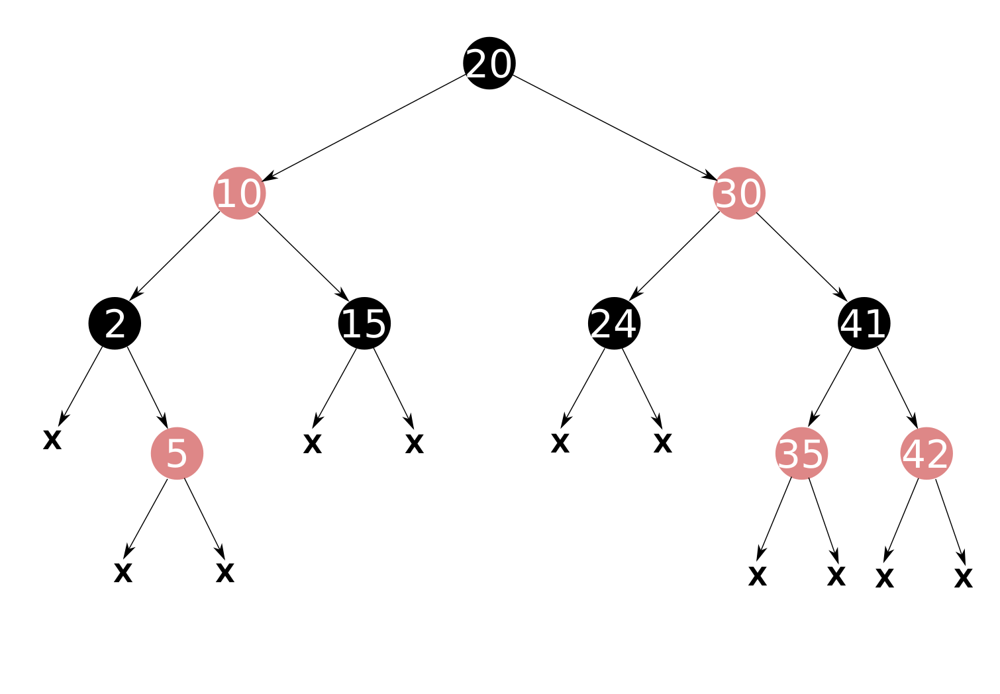

# Ordonnancement 

Plusieurs manières de partager les ressources :
* par lots : chaque tache a un accès exclusif au processeur jusqu'à sa terminaison
* multi-programmation : lorsqu'une tache est bloquée, une autre peut s'exécuter
* temps partagé : les tâches utilisent alternativement le processeur pendant leur exécution

# Processus sous Linux

Une tache (process/thread) peut être dans l'état : 
* RUNNING
* STOPPED
* DEAD

```c
struct task_struct{
    long state;
    pid_t pid;
}

/* Choix prochaine tache */
void schedule(void);

/* Réveil d'une tache */
int wake_up_process(struct task_struct *p);

/* Appel system yield */
long sys_sched_yield(void);

/* Fork/clone d'une tache */
void sched_fork(struct task_struct *p);

/* Terminaison d'une tache */
void exit(struct task_struct *p);

/* Handler du tick horloge */
void tick(struct task_struct *p);

/* Tache courante */
struct task_struct *current;s
```



# **Ordonnanceur round-robin (Linux 1.2)**

Les taches RUNNING sont rangées dans une fifo runnable.

```c
struct task_struct {
    int quantum;
    struct list_head list;
};


void schedule(void)
{
    struct task_struct *next;
    struct task_struct *prev = current;
    /* Si STOPPED, pop() */
    if (!(prev->state & TASK_RUNNING))
        list_del(&prev->list);
    /* Si une tache RUNNING, choisir */
    if (!list_empty(&runnable))
        next = list_first_entry(&runnable,
        struct task_struct,
        list);
    /* Sinon, devenir idle */
    else
        next = &idle_task;
    context_switch(prev, next);
}
```

Si une tache est dans l'état STOPPED on la pop, c'est à dire qu'on la retire de la file des taches RUNNING.
Sinon on prend la première tache RUNNABLE dans la fifo. S'il n'y a pas de tache RUNNABLE la fonction switch à la tache idle.

```c
void tick(void)
{
    current->quantum--;
    /* Si quantum epuise, preemption */
    if (!current->quantum) {
        list_del(&current->list);
        current->quantum = QUANTUM;
        list_add_tail(&current->list,
        &runnable);
        schedule();
    }
}
```
Cette fonction est appellée à chaque fois qu'un tick d'horloge se produit. A chaque appelle elle décrémente le quantum de la tache courante.

Une fois que le quantum de temps de la tache atteind 0, , la tâche est ajoutée à la fin de la liste des tâches prêtes à s'exécuter et un basculement de contexte est effectué en appelant la fonction "schedule".
Le quantum de la tâche en cours d'exécution est réinitialisé.

```c
void sys_sched_yield(void)
{
    list_del(&current->list);
    current->quantum = QUANTUM;
    list_add_tail(&current->list,
    &runnable);
    schedule();
}
```
Ceci est une appel système dans le noyau Linux qui permet à une tâche de céder volontairement le CPU. Lorsqu'une tâche appelle "sys_sched_yield", elle est retirée de la liste des tâches prêtes à s'exécuter, son quantum est réinitialisé à la valeur de "QUANTUM" et elle est ajoutée à la fin de la liste des tâches prêtes à s'exécuter. Un basculement de contexte est alors effectué en appelant la fonction "schedule".

Cet appel système est utile dans certaines situations où une tâche souhaite temporairement abandonner le CPU pour permettre à d'autres tâches de s'exécuter. Par exemple, une tâche peut appeler "sys_sched_yield" lorsqu'elle attend une ressource détenue par une autre tâche. En cédant le CPU, la tâche donne à l'autre tâche l'opportunité de libérer la ressource.

```c
int wake_up_process(struct task_struct *p)
{
    p->state = TASK_RUNNING;
    current->quantum = QUANTUM;
    list_add_tail(&p->list,
    &runnable);
}
```

"wake_up_process" est une fonction qui définit l'état d'une tâche sur "TASK_RUNNING" et l'ajoute à la fin de la liste des tâches prêtes à s'exécuter. Cette fonction est généralement utilisée pour rendre une tâche endormie exécutable à nouveau.

```c
void sched_fork(struct task_struct *p)
{
    p->state = TASK_RUNNING;
    current->quantum = QUANTUM;
    list_add_tail(&p->list,
    &runnable);
}
```

"sched_fork" est une fonction qui définit l'état d'une tâche nouvellement créée sur "TASK_RUNNING" et l'ajoute à la fin de la liste des tâches prêtes à s'exécuter. Cette fonction est généralement appelée lorsqu'une tâche est créée en utilisant l'appel système "fork".

```c
void exit(struct task_struct *p)
{
    p->state = TASK_DEAD;
    list_del(&p->list);
    if (current == p)
    schedule();
}
```

"exit" est une fonction qui définit l'état d'une tâche sur "TASK_DEAD" et la retire de la liste des tâches prêtes à s'exécuter. Si la tâche en cours d'exécution est la tâche qui est fermée, un basculement de contexte est effectué en appelant la fonction "schedule". Cette fonction est généralement appelée lorsqu'une tâche termine son exécution.

Avantage :
* complexité O(1)
* simplicité
Inconvéniants :
* Inéquités : taches interactives désavantagées
* Interactivité : latence sensible à la charge

# **Ordonnanceur O(N) (Linux 2.4)**

Toutes les taches sont rangées dans une liste chainnées tasks.
Les taches RUNNING sont rangées dans une liste chainée runnable.

```c
struct list_head runnable;
struct list_head tasks;
struct task_struct {
    int nice;
    int timeslice;
    struct list_head task_list;
    struct list_head run_list;
};

void schedule(void)
{
    struct task_struct *next, *prev = &current;
    struct task_struct *tmp;
    /* Si STOPPED, retirer de runnable */
    if (!(prev->state & TASK_RUNNING))
        list_del(&prev->run_list);
    
    retry:
    next = &idle_task;
    /* Si RUNNING dispo */
    if (!list_empty(&runnable)) {
    /* Recherche meilleure goodness */
        list_for_each_entry(tmp, &runnable, run_list)
    if (goodness(tmp) > goodness(next))
        next = tmp;
    /* Si toute timeslice epuisee, recalcul */
    if (!next->timeslice) {
        list_for_each_entry(tmp, &tasks, task_list)
    tmp->timeslice = tmp->nice + tmp->timeslice >> 2;
    goto retry;
    }
    }
    context_switch(prev, next);
}
```

Si la tache n'est pas dans l'état TASK_RUNNING on la retire de la liste. Sinon :
* par défaut la tache est mise à idle_task
* on recherche la task avec la plus grande valeur de goodness
* Si aucune tache n'est trouvée 

Avantages :
* Equité : basée sur nice
* Interactivité : basée sur nice
Inconvéniants :
* Complexité : O(n)

# **Ordonnanceur O(1) (Linux 2.6)**

```c
struct task_struct {
    struct list_head list;
    int timeslice;
    int prio;
};
struct prio_array {
    struct list_head array[140];
    unsigned int nr_tasks;
};
struct rq {
    struct prio_array *active;
    struct prio_array *expired;
};

void tick(void)
{
    /* timeslice restante diminue */
    current->timeslice--;
    /* si timeslice epuisee, devenir expired */
    if (!current->timeslice) {
        update_prio(current);
        list_del(current->list);
        rq->active.nr_tasks--;
        list_add_tail(&current->list,
        &rq->expired[current->prio]);
        rq->expired.nr_tasks++;
        update_timeslice(current);
        schedule();
    }
}
```

La fonction ``tick()`` est une fonction appelée en réponse à une interruption timer, elle décrémente la valeur de timeslice. Si timeslice vaut 0, la tache est retirée de la file prioritaire et est bougée dans une file **expirée**.

```c
void schedule(void)
{
    int i;
    struct task_struct *next = &idle_task,
    *prev = current;
    /* si STOPPED, retirer de prio_array */
    if (!(prev->state & TASK_RUNNING)) {
        list_del(prev->list);
        rq->active.nr_tasks--;
    }
    /* Permute active/expired si active vide */
    if (!rq->active.nr_tasks)
        swap_pointers(rq->active, rq->expired);
    /* Choisir la tache la plus prioritaire */
    for (i = 0; i < 140; i++) {
        if (!list_empty(rq->active.array[i])) {
            next = list_first_entry(rq->active.array[i],
            struct task_struct, list);
            break;
        }
    }
    context_switch(prev, next);
}
```

Comme précédemment la fonction ``schedule()`` selectionne la tache à lancer. Si la tache courante n'est pas dans l'état RUNNING elle est retirée de la file `active`.
Quand la file `active` est vide, elle est echangée avec la file `expirée`. Ensuite on choisi la tache la plus prioritaire.

Avantages :
* Complexité : O(1)
* Interactivité : basée sur la priorité
Inconvéniants :
* Code : heuristiques du calcul de la priorité complexes 
    -> potentiellement des erreurs

# **Completely Faire Scheduler (depuis Linux 2.6.23)**
## **Arbre rouge-noir**
Le Completely Fair Scheduler utilise un **arbre rouge-noir** pour représenter l'ensemble des tâches exécutables, classées par le temps d'exécution virtuel de chaque tâche.

Chaque tâche se voit attribuer une part équitable de temps CPU, proportionnelle à sa priorité. Lorsqu'une tâche se réveille, elle est insérée dans l'arbre rouge-noir en fonction de son temps d'exécution virtuel, et le planificateur sélectionne le nœud le plus à gauche dans l'arbre, qui représente la tâche avec le temps d'exécution virtuel le plus court, pour être exécutée en premier.

Lorsqu'une tâche s'exécute, son temps d'exécution virtuel est mis à jour et sa position dans l'arbre rouge-noir peut changer. Cela permet au planificateur de maintenir l'équité et d'éviter la famine, car les tâches avec des temps d'exécution virtuels plus courts auront tendance à s'exécuter plus souvent.

Un **arbre rouge-noir** est un arbre binaire de recherche équilibré.

Un arbre de recherche équilibré a les propriétés suivantes :
* suppression d'une feuille : il suffit de l'enlever puisqu'elle n'a pas de fils
* suppression d'un noeud avec enfant : on remplace le noeud par l'enfant

En plus des propriétés ci dessus, l'arbre rouge-noir a les propriétés suivantes :

Propriétés :
* Un noeud est rouge ou noir
* La racine est noir
* Les feuilles sont noires et valent NULL (x)
* Si N est rouge, N -> left et N -> right sont noirs
* Tout chemin de la racine à une feuille contient le même nombre de noeuds noirs



ATTENTION, en cas d'insertion de noeud il faut toujours s'assurer que le nombre de noeuds noir est le même sur chaque chemin, ainsi il est possible de changer la couleur d'un noeud.

Complexité :
* Recherche O(log(N))
* Insertion : O(log(N))
* Suppression : O(log(N))

## **Implémentation**

Les taches RUNNING sont contenues dans un arbre rouge-noir trié par vruntime.

```c
struct task_struct {
    unsigned long vruntime;
    u64 exec_start, slice;
    unsigned long load;
    struct rb_node run_node;
};

struct rq {
    struct rb_root tasks;
    unsigned long load;
    unsigned int nr_running;
};

void schedule(void)
{
    struct task_struct *prev = current;
    struct task_struct *next = &idle_task;
    /* Si RUNNING, reinserer dans le rb_tree */
    if (prev->state & TASK_RUNNING)
        enqueue_task(rq, prev);
    /* Si rq vide, devenir idle */
    if (!rq->nr_running)
        goto ctx_switch;
    /* Sinon, choisir la tete de rq */
    next = rb_entry(rb_first(&rq->tasks),
    struct task_struct, run_node);
    ctx_switch:
    context_switch(prev, next);
}
```

gpt est down......................

Avantages : 
* Complexité O(log(N))
* Equité : basée sur le vruntime
* Interactivité : basée sur le vruntime
Inconvéniants :
* Code heuristique devenu complexe avec le temps
* Taille du code : environ 23k lignes

# Multi coeur 

Depuis (Linux 2.6) chaque CPU possède sa struct rq, ordonnancée localement et protégé par un spin lock