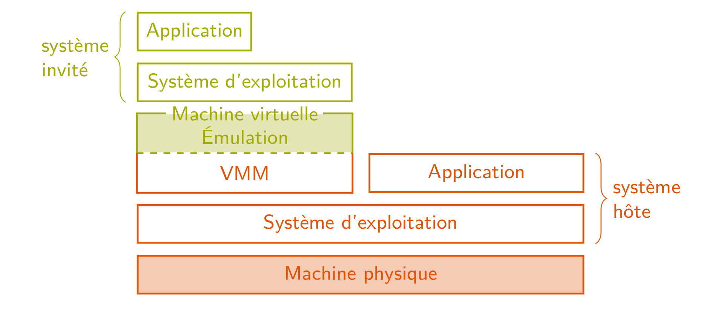
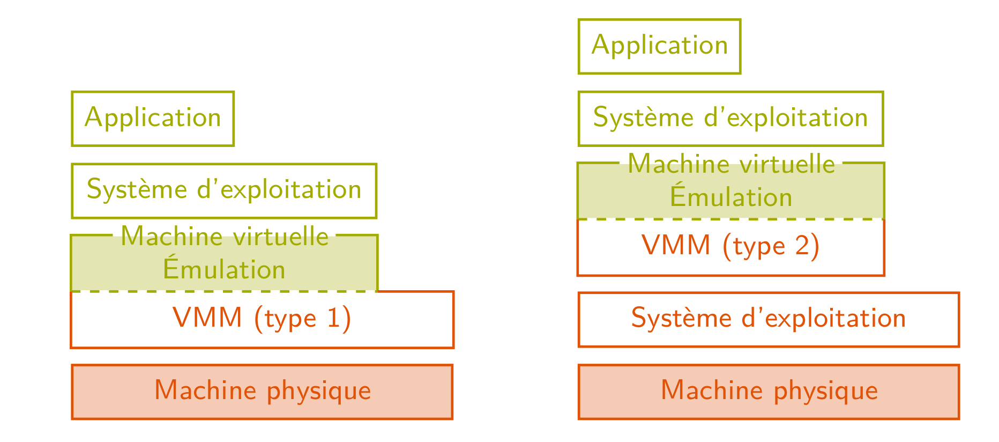
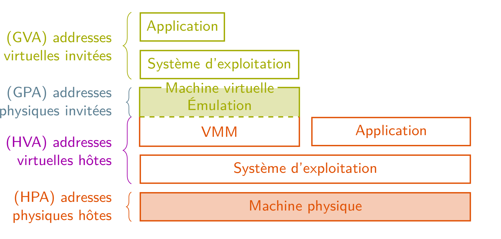
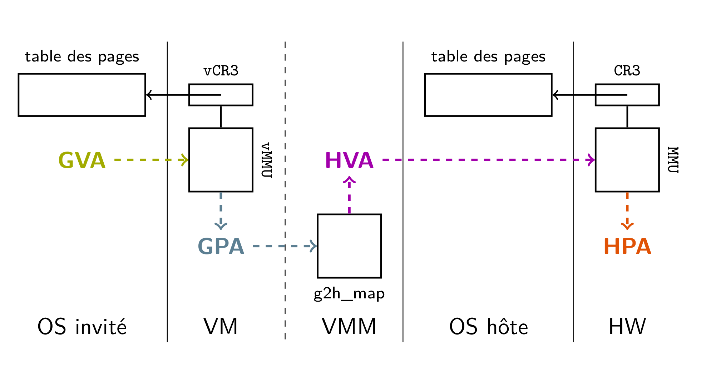
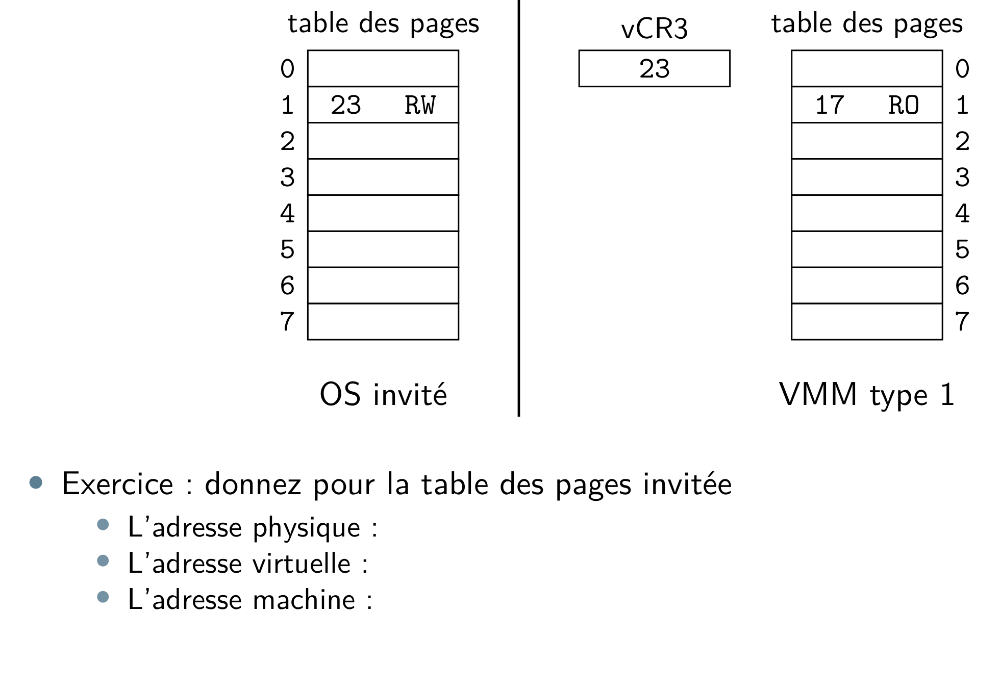
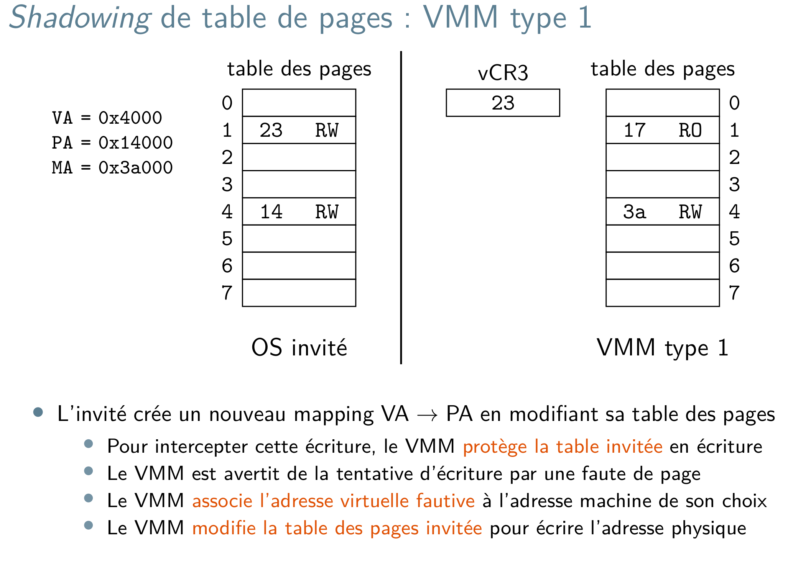
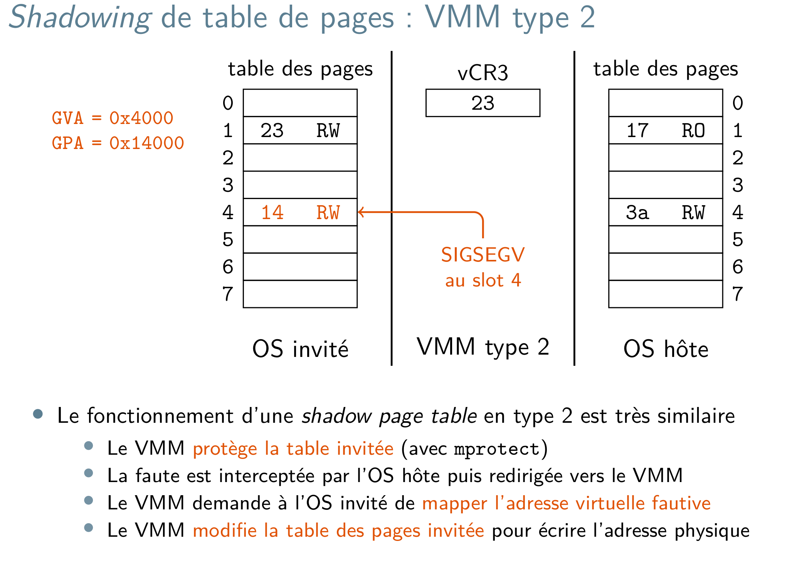

# Virtualisation d'instructions
## Simulation cycle accurate

Dans le cas d'un simulation cycle accurate, on va simuler l'ensemble des composants de la machine virtuelles. On peut faire ca grace à des langages HDL (VHDL, verilog, systemC...etc).

Cette simulation permet une observation fine des exécutions :
* estimation des perfs au cycle près
* interaction logiciel/matériel observable et reproductible
....

Beaucoup de calculs nécessaire -> simulation lente (facteur 100)
## De la simu à l'ému

* Usage de VM :
    * simuler nveau matériel
    * portage logiciel sur différentes archi

Bref l'idée c'est d'émuler le jeu d'instruction.

Vocabulaire :
* **système hote**    : ensemble des programmes qui utilisent directement les ressources de la machine
* **système invité**  : ensemble des programmes qui utilisent les ressources de la machine via l'interface d'une VM
* **moniteur de machine virtuelles** : VMM est un logiciel qui présente une interface de VM aux système invité



* Moniteur de type 1 : 
Il s'execute en mode privilégié et est l'unique programme hote. On gros c'est comme si on lancait un OS sauf que l'hyperviseur va permettre de démarrer plusieurs machine virtuelle typiquement.
* Moniteur de type 2 : 
Il s'exécute en mode User et est en concurrance avec d'autres programmes hôtes



Qemu-KVM est de type "1.5" (KVM = kernel virtual machine, c'est un module qu'on insère dans le noyau Linux)

## **Emulation d'instruction**

Etape :
* récupère le code système invité (inst suivante)
* décode l'instruction
* le guest execute l'instruction

exemple :
```c
while(TRUE){
    bin = guest.next_instruction();
    inst = decode_instruction();
    guest.execute_instruction();
}
```
Les instructions décodées logiciellement selon l'opcode de la machine virtuelle.

L'hyperviseur doit émuler les composants matériels, il va donc créer un vcpu qui est une structure mémoire qui va contenir les registres virtuelles. L'adresse de ces registres n'est pas accessible depuis la machine guest.

**VMM = virtual machine manager**

Le VMM utilise uniquement des instructions non privilégiées pour modifier l'état de la VM.

### **Conclusion**
* L'émulation d'instructions est une technique de virtualisation où le VMM décode et interprète chaque instruction du système invité.
* Le VMM execute les instructions décodés en utilisant un état virtuel de la machine exposée au système invité
* L'émulation est plus rapide que la simu bit accurate mais reste plus lente qu'une exécution physique

## **Émulation optimisée**

Quand on a une boucle, on va en permanence décoder les même trucs.  Le travail du décodage pourrait être réexécuté.

Au lieu de faire inst par inst on va travailler sur des basic block. On va fetch, decoder et exécuter des **basic block**.

**basic block** = partie du code non conditionnelle, ie partie du code délimitée par des branchements. En pratique il doit y avoir une taille limite mais rarement atteinte.

**Compilation à la volée :**
Abandon de la boucle **fetch-decod-execute**, utilisation d'une boucle **fetch-compile-branch**.

Les basic blocks sont compilés vers le jeu d'instructions de l'hôte. Cette compilation s'appelle une **Dynamic Binary Translation** (DBT).

### Problèmes

Il n'y a pas toujours une correspondance 1:1 entre les jeux d'instructions. Parfois une instruction devient deux instructions.

Le pb c'est que si la taille du bloc varie les adresses des instructions peuvent changer et par conséquent les adresses des branchements peuvent ne plus être les même.

Il faut sauvegarder le contexte du cpu puis le restaurer entre chaque basic bloc.

Les blocs source sont branchés les uns sur les autres.

Les instructions privilégiées sont traduitent par des appels de fonctions d'émulation.

### Conclusion 

* **Le dynamic binary translation** est une technique de virtualisation où le VMM compile et exécute chaque basic block du système invité
* un basic block est une liste d'instruction dont la dernière est l'unique instruction de saut
* instructions non privilégiées sont traduites par une ou plusieurs instrucitons non privilégiée équivalente
* instruction privilégiées sont traduites par un appel à la fonction d'émulation correspondante

# Virtualisation de ressources

Le système invité accède à sa propre mémoire, il a donc besoin d'avoir une correspondance mémoire virtuelle <--> mémoire physique.



Pour les VMM de type 2, on a donc les types d'adresse suivantes :
* GVA : guest virtual addresses
* GPA : guest physical addresses
* HVA : host virtual addresses
* HPA : host physical addresses

Pour les VMM de type 1, on ne distingue pas les (GPA) et les (HVA), on utilise plutôt la terminologie virtuelle/physique/machine.

La VMM utilise une structure logicielle quelconque pour faire l'association `GPA -> HVA`.
La MMU physique utilise la table des pages du système hôte pour faire la traduction `HVA -> HPA`.

Le système invité attend que la MMU fasse la traduction `GVA -> GPA` :
* Solution : émuler l'action de la MMU à chaque accès mémoire invité
* Le VMM parcours la PTE en utilisant un CR3 virtuel



Just a quick exercice 'bout shadowing :



On regarde la table des pages OS invité, la case mémoire remplie est à l'index 1, donc l'adresse virtuelle vaut :
* 0x1000
Cette adresse est traduit en adresse physique, 0x23000, puis cette adresse est traduite en 0x17000.

L'invité veut faire un mapping VA = 0x4000 -> PA = 0x14000 :
* Pour intercepter l'écriture le VMM protège la table invitée en écriture
* Le VMM est averti de cette tentative d'écriture par une page fault
* Le VMM associe l'adresse virtuelle fautive à l'adresse machine de son choix
* Le VMM modifie la table des pages invité pour écrire l'adresse physique

Ca veut dire que le système invité ne peut pas directement écrire dans la table des pages invité, ca passe par le VMM et c'est lui qui réalise l'écriture.

Exemple avec VMM type 1 :


Pour les VMM de type 2, c'est un peu différent :



* L'hote et l'invité partagent le même espace virtuel :
    * l'invité peut utiliser une VA déjà atttribuée à l'hôte
    * les GVA et les HVA sont traitées de la même manière par la MMU physique

* différentes solutions pour isoler l'invité 
    * utiliser un espace virtuel dédié pour l'invité
    * émuler tous les accès à une zone réservée à l'hote
    * déplacer l'hôte en cas de conflit 
    
# Virtualisation comme isolation