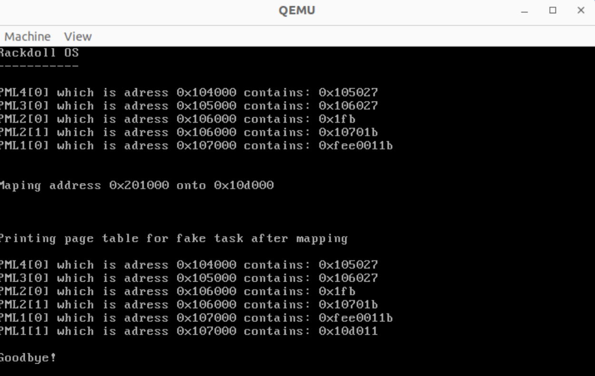
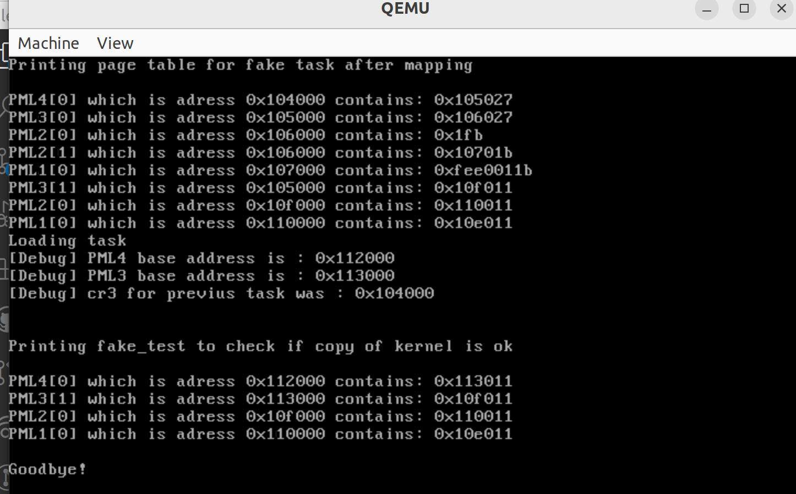

# Introduction

Les niveaux intermédiaires sont mappés par des idéntités, ie que pour accéder à une table des pages il suffit d'envoyer l'adresse physique de cette dernière puisqu'elle est égale à son adresse virtuelle.

# Exercice 1 :

# Question 1 :
```
Dans le cadre de ce TP on supposera toujours qu’un niveau intermédiaire de la table des pages est mappé
par une identité (il est accessible par une adresse virtuelle égale à son adresse physique). Pourquoi cette supposition est-elle importante ?
```

L'adresse physique de la table des pages est stockée dans le registre CR3, le CPU manipulant uniquement des adresses virtuelles il a besoin que l'adresse de la table des pages n'ait pas besoin d'être traduite. Si elle avait besoin d'une traduction il faudrait qu'il accède à la table des pages, or il ne peut pas y accéder s'il manipule une adresse virtuelle nécessitant une traduction.


# Question 2 :

```
Combien y a-t-il d’entrée par niveau de table des pages pour une architecture x86 64 bits ? Comment la
MMU détermine-t-elle si une entrée d’un niveau de table des pages est valide ? Si elle est terminale ?
```

La table des pages est divisée en 4 PML, chacune de ces PML étant encodé par 9 bits de l'adresse, elles contiennent donc 2^9 entrées.

La table des pages contient une adresse sur 64 bits, l'adresse est découpée comme suit :
* addr[63]      : NX, indique si la page est accessible en exécution
* addr[62:52]   : non utilisés
* addr[51:12]   : Adresse de la page physique
* addr[11:0]    : bits donnant des informations sur la page

On trouve dans les bits [11:0] des informations sur la validité de la page, c'est le bit P donc le ``bit 0`` qui donne l'information sur la validité de la page.\
On trouve ensuite le bit PS qui indique si la page pointée est une ``huge page``, si la page est une huge page alors cela signifie qu'elle est terminale.


# Question 3 : 

```
Dans kernel/main.c, programmez et testez la nouvelle fonction print_pgt. Vous testerez votre nouvelle fonction en l’appellant depuis la fonction main multiboot2 située dans le fichier kernel/main.c juste avant le chargement des tâches utilisateur. Pour cela vous pouvez utiliser la fonction uint64_t store cr3(void) qui retourne le contenu du registre CR3.
Si votre fonction d’affichage fonctionne correctement, vous devriez observer une table des pages avec la structure indiquée dans l’annexe de ce sujet.
```

On peut en effet bien visualiser la table des pages qui s'affiche correctement. Pour vérifier que tout fonctionne bien, j'ai utilisé la commande ``xp\512g address`` quand qmu, qui permet de visualiser 512 adresses à partir de l'adresse ``address``. Ainsi si j'ai en entrée une adresse qui correspond au début de la table des pages, je vais pouvoir visualiser cette dernière dans son entièreté.

On fera attention à ne pas rappeler la fonction dans le cas où l'on aurait une Huge page, en effet, peut importe le niveau d'une huge page cette dernière est terminale.

# Exercice 2 :

Pour des soucis de simplicité, on fait les suppositions suivantes :
* Les niveaux intermédiaire de la table des pages sont tous mappés par une identité
* Tous les niveaux de mappings seront fait avec les droits utilisateurs et en écriture
    * bit U/S à 0
    * bit R/W à 1
* On ne gère pas les huge page, donc on a bien les 4 niveaux de PML
* Si un mapping est demandé pour une adresse virtuelle a, l'adresse virtuelle a n'est pas déjà mappée. La fonction ``paddr_t alloc_page()`` alloue une page déjà mappée par une identité.

# Question 1 :

```
Etant donné une adresse virtuelle vaddr à mapper et la hauteur courante dans la table des pages lvl
(avec lvl = 4 pour le niveau indiqué dans le CR3), donnez la formule qui indique l’index de l’entrée
correspondante dans le niveau courant.
```

* On élimine les bits de poids fort : vaddr & 0xFFFF FFFF FFFF
* On shift de sorte à éliminer les 12 bits de poids faible et à accéder à la bonne PML :
    (vaddr & 0xFFFF FFFFFFFF) >> (12 + 9*(lvl - 1))

# Question 2 :

```
Implémentez la fonction ``void map_page(struct task *ctx, vaddr_t vaddr, paddr_t paddr)``
dans le fichier kernel/memory.c qui mappe l’adresse virtuelle vaddr sur l’adresse physique ``paddr`` sur
un espace d’une page pour la tâche ctx. L’adresse physique du premier niveau de la table des pages est
indiquée par ctx->pgt.
Pour cet exercice, n’hésitez pas à tester très régulièrement votre fonction à chaque étape de son implémentation.
On pourra pour cela utiliser le morceau de code suivant depuis kernel/main.c :
```

```c
struct task fake;
paddr t new;

fake.pgt = store_cr3();
new = alloc_page();

map_page(&fake, 0x201000, new);
```
```
Si votre fonction map page fonctionne, vous devriez pouvoir inspecter la mémoire à l’adresse 0x201000 à
l’aide du moniteur de Qemu avec la commande x/8g 0x201000.
```

Pour vérifier que la fonction est correcte on procède comme suit :
* L'adresse virtuelle que l'on veut mapper vaut ``0x201000``, ce qui peut dire que :
    * L'index de PML4 vaut 0
    * L'index de PML3 vaut 0
    * L'index de PML2 vaut 1
    * L'index de PML1 vaut 1
L'adresse virtuelle dans donc faire le "chemin" PML4[0]->PML3[0]->PML2[1]->PML[1]
* l'adresse de base de la PML4 est ``0x104000``
* Le contenue de l'adresse mémoire ``0x104000`` est ``0x105027``, qui correspond à l'adresse de base de la PML3 ``0x105000`` (on ignore les 12 bits de poids faible)
* Le contenue de l'adresse mémoire ``0x105000`` est ``0x106027``, qui correspond à l'adresse de base de la PML2 ``0x106000``
* Le contenue de l'adresse mémoire ``0x106008``(base + index) est ``0x10701b``, qui correspond à l'adresse de base de la PML1 ``0x107000``
* Le contenue de l'adresse mémoire ``0x107008``(base + index) est ``0x10d011``, qui correspond bien à la traduction de l'adresse physique initiale



# Exercice 3
# Question 1
```
A cette étape du TP, l’exécution de Rackdoll doit afficher sur le moniteur qu’une faute de page se produit a l’adresse virtuelle 0x2000000030. Etant donné le modèle mémoire, indiquez ce qui provoque la faute de page.
```
Dans le ``main.c``, on peut voir l'appelle à la fonction ``loads_tasks()``, or cette fonction n'est pas encore définie. ``0x2000000000`` est l'adresse de base du segment USER. Lorsque l'on chercher à charger un programme on va donc placer le code et les données de ce dernier dans cette zone mémoire.\
Etant donné que la fonction n'est pas défini l'appel de la fonction ``run_tasks()`` provoque une segfault puisque l'on va tenter d'accéder à une zone mémoire qui n'est en réalité pas initialiser.

# Question 2 :

```
La première étape de la création d’une nouvelle tâche en mémoire est de dériver la table des pages courante en
une nouvelle table des pages. Expliquez quelles plages d’adresses de la table courante doivent être conservées
dans la nouvelle table et pourquoi.
Une tâche utilisateur ctx est constituée de deux parties :
— Le payload situé dans la mémoire physique entre ctx->load paddr et ctx->load end paddr qui
contient le code et les données.
— Le bss qui doit commencer en espace virtuel immédiatement après le payload et s’arrêter à l’adresse
virtuelle ctx->bss end vaddr.
On rappelle que le bss est une zone qui doit être initialisée à zero au lancement d’un tâche. Il est possible
que certaines tâches aient un bss vide.
```

Lorsque l'on commute de tache ou que l'on créer une nouvelle tache, on va devoir changer la valeur du CR3. Or changer la valeur du CR3 implique de perdre l'ancienne table des pages.\
Néamoins les données du système d'exploitation sont communes à chaque tache, en effet l'OS stocke tout un tas de données (variables globales, locket, variables d'environnement...etc) qu'il faut conserver et garder identique pour chaque programme.

Il faut donc copier la table des pages qui traduit les adresses du kernel. 

On peut lire dans les commentaires de ``memory.c`` que les 2 permiers MiB sont les données de la zone kernel mappés par des identités, il faut donc copier ces traductions. Il faut également copier la traduction des zones entre ``0x100000`` et ``0x40000000`` qui contiennent également des données de la zone kernel.


Le kernel est donc compris entre ``0x0`` et ``0x40000000``. Or:
```
0x40000000 =    01          | 00 0000 000 | 0 0000 0000 | 0000 0000 0000
                INDEX PML3  | INDEX PML2  | INDEX PML1  | OFFSET                                     
```

Il suffit donc de copier PML3[1] dans la nouvelle table des pages pour conserver les données de la zone kernel.

# Question 3 :

```
Donnez les adresses virtuelles de début et de fin du payload et du bss d’une tâche, calculées en fonction du
modèle mémoire et des champs d’une tâche ctx.
```
Le payload est la partie ded la mémoire qui contient le code et les données. On a : 

* Adresse virtuelle de début du payload : ``ctx -> load_vaddr`` 
* Adresse virtuelle de fin du payload : ``ctx -> load_vaddr + (load_end_paddr - load_paddr)``

Le bss (block starting symbol) est un segment mémoire qui contient les variables statiquement allouées qui sont déclarée mais pas initialiser. On a :

* Adresse virtuelle de début du .bss : ``ctx -> load_vaddr + (load_end_paddr - load_paddr) + 8``
* Adresse virtuelle de fin du .bss : ``ctx->bss_end_vaddr``

# Question 4 : 
```
Implémentez la fonction void load task(struct task *ctx) qui initialise une nouvelle tâche en
mémoire sans toutefois charger sa table des pages dans le CR3.
```

On s'occupe dans un premier temps de copier PML3, pour tester la fonction j'ai modifié le main.c de facon à avoir :
```c
// Custom
	struct task* fake_task;
	paddr_t page2 = alloc_page();
	fake_task->pgt = page2;

	struct task os;
	os.pgt = store_cr3();
	paddr_t random_adr = alloc_page();
	vaddr_t vadr_os = 0x40000000;
// End custom

map_page(&os, vadr_os, random_adr);

load_task(fake_task);
printk("\n\nPrinting fake_test to check if copy of kernel is ok\n\n");
print_pgt(fake_task->pgt, 4);

```

L'idée est la suivante :\
J'ai besoin que PML3[1] soit mapper pour une tache quelconque afin d'avoir une entrée non nulle.\
Pour faire ca je vais donc initialiser une fausse tache que j'ai appelé ``os``. Je vais mapper l'adresse ``0x40000000`` dans cette tache à une adresse physique virtuelle random. L'idée c'est donc de généré une entrée dans PML3[1], ``0x40000000`` correspond à un index de 1 sur la PML3.

Ensuite je génère une fausse tache que je vais loader avec la fonction ``load_task()`` et je vais vérifier que l'entrée de la PML3[1] est bien copiée.



On peut voir sur l'image ci dessus que l'on a bien la table des pages qui a été correctement recopiée après l'appelle de la fonction load_task().

# Question 5 : 
```
Implémentez la fonction void set task(struct task *ctx) qui charge une nouvelle tâche en mémoire
en modifiant le CR3.
```
cf code.

# Exercice 4 :


**Question 1 :**

```
Implémentez la fonction void mmap(struct task *ctx, vaddr t vaddr) qui alloue une page phy-
sique, l’initialise à zero et la mappe à l’adresse virtuelle donnée pour la tâche donnée.
```

**Question 2 :**

```
Á cette étape du TP, l’exécution de Rackdoll doit afficher sur le moniteur qu’une faute de page se produit
à l’adresse virtuelle 0x1ffffffff8. Étant donné le modèle mémoire, indiquez ce qui provoque la faute de
page. D’après vous, cette faute est-elle causée par un accès mémoire légitime ?
```

**Question 3 :**

```
D’après le modèle mémoire de Rackdoll, la pile d’une tâche utilisateur a une taille de 127 GiB, c’est à dire
bien plus que la mémoire physique disponible dans la machine virtuelle. La pile est donc allouée de manière
paresseuse. Expliquez en quoi consiste l’allocation paresseuse.
```

**Question 4 :**

```
Implémentez la fonction void pgfault(struct interrupt context *ctx) qui traite une faute de
page dont le contexte est stocké dans ctx et où l’adresse qui a causé la faute est stockée dans le re-
gistre CR2 accessible via la fonction uint64 t store cr2(void). Rappellez-vous que les seules fautes
de page légitimes sont celles de la pile. Toute faute à une adresse en dehors de la pile doit causer unefaute de segmentation de la tâche courante (vous pouvez utiliser la fonction void exit task(struct
interrupt context *ctx) qui termine la tâche courante).
```

# Remarques :
* https://gcc.gnu.org/onlinedocs/gcc/Extended-Asm.html