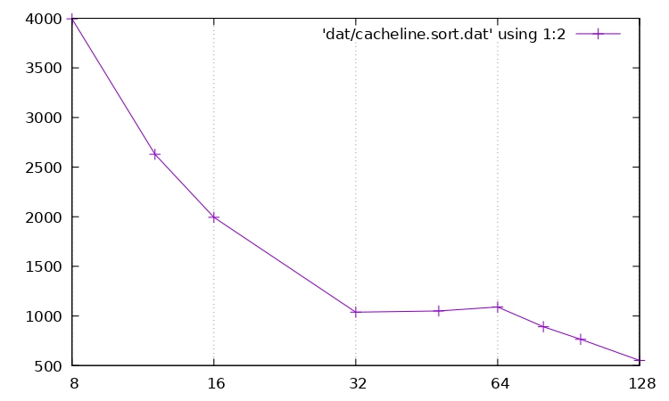

# Introduction : Topologie mémoire

L'objectif de ce TP est de découvrir les propriétés du cache d'une machine. Pour faire cela on va utiliser des codes assez simples, spécialement concu pour stresser une partie précise du matériel.

# Exercice 1

```c
char *mem = allocate_and_touch_memory(MEMORY_SIZE) ;
start_timer();
for(int i = 0; i < MEMORY_SIZE ; i += PARAM)
    mem[i] = 1;
stop_timer();
```

# Question 1 :

Initialiser une zone mémoire permet de faire un grand nombre d'accès mémoire dans une zone contigue. On va donc exploiter la localité spatiale et pouvoir mesurer comment le cache répond.\
On est obligé d'initialiser la mémoire, puisque la mémoire est véritablement allouée que lorsqu'on l'utilise, faire simplement un malloc, par exemple, ne suffirait pas à manipuler la mémoire.


# Question 2

En thoérie la boucle peut générer les deux. Tout va dépendre de la valeur des paramètres MEMORY_SIZE, PARAM et de la consitution interne du cache.

# Question 3 

Lorsque le paramètre PARAM augmente on augmente le nombre de MISS.\
Lorsqu'il est très inférieur à la taille d'une ligne de cache, le cache va faire très peu de MISS, lorsqu'il est de la taille d'une ligne environ on va faire beaucoup de MISS. Enfin s'il est très largement supérieur le cache fera aussi beaucoup de MISS.

Approximativement :
- Si PARAM << taille ligne de cache : taux de HIT = 100% environ
- Si PARAM >> ou égal à taille ligne de cache : taux de HIT environ 0%

Si MEMORY_SIZE est plus petit que la taille du cache alors l'entièreté des données peuvent tenir dans le cache et ce dernier n'a pas d'impact sur les MISS. Ce n'est néamoins pas le cas lorsqu'il est plus grand que la taille du cache.

# Question 4

Lorsque :
- Si PARAM << taille ligne de cache : 
- Si PARAM >> taille ligne de cache : 
- Si PARAM =  taille ligne de cache : 

# Question 5

```c
#ifndef PARAM
#  define PARAM            64
#endif

#define CACHELINE_SIZE     PARAM
#define MEMORY_SIZE        (32 * PAGE_SIZE)
#define WARMUP             10000
#define PRECISION          1000000


static inline uint64_t detect(char *mem)
{
	size_t i, p;
	uint64_t start, end;

	for (p = 0; p < WARMUP; p++)
		for (i = 0; i < MEMORY_SIZE; i += CACHELINE_SIZE)
			writemem(mem + i);

	start = now();

	for (p = 0; p < PRECISION; p++)
		for (i = 0; i < MEMORY_SIZE; i += CACHELINE_SIZE)
			writemem(mem + i);

	end = now();

	return (end - start) / PRECISION;
}
```

On va exécuter WARMUP fois la boucle 
```c
for (i = 0; i < MEMORY_SIZE; i += CACHELINE_SIZE)
			writemem(mem + i);
```

La boucle WARMUP permet de charger des valeurs dans le cache qui vont provoquer des MISS, en effet on charge bien des données à partir de mem+i, mais on charge des donnée sur une plage ce 128Ko. Or en pratique il est très rare de trouver des caches L1 de cette taille, donc si l'on suppose par exemple que le cache L1 fait 32Ko (cas le plus courant), alors les données qui se trouveront dans le cache à la fin de la boucle seront les données à la fin de la zone MEMORY_SIZE.

Donc quand la 2ème boucle sera exécutée :
```c
for (p = 0; p < PRECISION; p++)
		for (i = 0; i < MEMORY_SIZE; i += CACHELINE_SIZE)
			writemem(mem + i);
```
Elle fera des MISS puisqu'elle manipulera des données du début de la zone mémoire qui ne sont donc pas chargée dans le cache.

# Question 6 :



Ce graphique indique en abscisee la valeur de PARAM et en ordonnée le temps d’exécution moyen de la boucle principale en nanoseconde.

On cherche à écrire des données à partir de l'adresse mem, au plus, on écrira 128Ko, en effet MEMORY_SIZE = 128Ko.

Lorsque l'on augmente le paramètre PARAM on va augmenter la dispersion des accès en accédant à des données de plus en plus éloignée. Ainsi on va réduire le nombre d'accès ce qui va réduire le temps d'exécution du programme. Néamoins en faisant ca on va augmenter le taux de MISS.

Cela aura pour effet d'avoir une courbe décroissante (le temps diminuant avec les accès mémoire) qui devrait légèrement remonter à partir du moment où l'on atteindra une valeur plus grande que la quantité de donnée présente dans une ligne de cache, ce qui provoquera en effet des MISS à chaque accès.

Typiquement les données que j'ai obtenu sont les suivantes :
```
	CACHE_LINE 	| TEMPS
			8 	|	5371
			12	| 	3342
			16	| 	2018
			32	| 	1063
			48	| 	1041
			64	| 	1077
			80	| 	871
			96	| 	727
			128	| 	668

```
On peut remarquer que quand CACHELINE vaut 64 le temps remonte légèrement, on peut donc en déduire qu'une ligne de cache vaut 64 octets.

# Exercice 2

# Question 1 :

On considère une zone mémoire de taille PARAM inférieure à la taille du cache. Si on pose X la taille d'une ligne de cache en octets et que l'on considère que le cache ne contenait aucun élément de cette zone à l'initialisation, on aura donc $\frac{PARAM}{X}$ miss.

Lors des séquences d'accès suivantes il n'y aura aucun MISS puisque les données seront déjà présente dans le cache.

# Question 2 :

Si au contraire la PARAM est supérieur à la taille du cache, on aura également $\frac{PARAM}{X}$ miss, en reprenant les notations de la question précédente.

Néamoins lors des itérations suivantes on aura également des MISS puisqu'une partie des données aura été évincées du cache. Les caches utilisant des politiques LRU ce seront les plus vieilles données qui auront été écrasées, ce qui veut dire que quand la boucle sera re-exécutée, les données chargées initialement feront MISS, écrasant les données les plus anciennes. A chaque itération, on fera donc $\frac{PARAM}{X}$ MISS.

# Question 3 :

Si PARAM << taille cache, alors un accès mémoire d'environ 3 à 5 cycles, soit le nombre de cycle nécessaire pour accéder au cache, en effet le nombre de MISS puisqu'à chaque itération les données seront déjà présentes.

Néamoins si PARAM >> taille cache, alors on fera des MISS tous les X accès et dans ce cas un accès sera de l'ordre de grandeur du temps d'un MISS et donc d'un chargement de bloc entre le cache L1 et le cache L2, soit une dizaine de cycles.

# Question 4 :


# Remarques :
* https://stackoverflow.com/questions/794632/programmatically-get-the-cache-line-size
